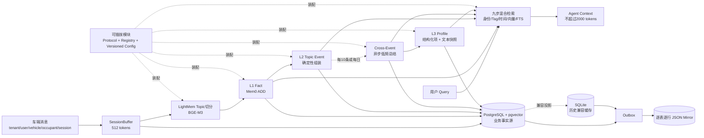

# DesayMem_light 整体算法架构图

## 汇报口径

- 在线链路只在 Topic 封包后进行一次 L1 Qwen 抽取；Topic 切分、Event 生成和检索不调用 Qwen。
- Cross-Event 和 Profile 在异步低峰批量处理，各自每批最多一次 Qwen。
- PostgreSQL 是唯一业务事实源，SQLite 是兼容缓存，JSON 通过 Outbox 保证可恢复的一一对应。
- 所有算法节点均通过稳定接口、显式注册和版本化配置实现可插拔。
