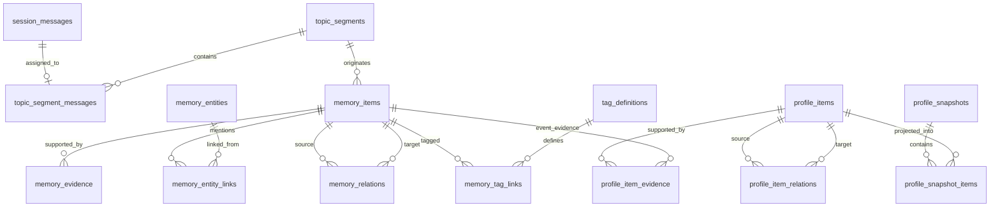

# 设计 Step 10：V1 ER 基线与迁移顺序

## 1. 冻结范围

本文件是 V1 表结构的汇总基线。前面 Step 1~9 说明设计原因；实现迁移时以本文件的表名、关系和迁移顺序为准。

V1 使用 PostgreSQL schema：`desaymem_light`。所有 ID 由应用生成 UUID；时间统一使用 `TIMESTAMPTZ`，数据库默认 UTC。

## 2. ER 关系



Checkpoint、Job、Audit、Usage 和 Mirror 基础设施通过逻辑 ID 关联，不强制加入 ER 外键链。

## 3. PostgreSQL 业务表基线

### A. Session

1. `session_messages`
   - 主键：`id`
   - 幂等：`UNIQUE(tenant_id, request_id)`
   - 顺序：`UNIQUE(tenant_id,user_id,vehicle_id,occupant_id,session_id,sequence_no)`

2. `topic_segments`
   - 主键：`id`
   - 保存抽取输入快照、token 数、边界原因和处理状态

3. `topic_segment_messages`
   - 主键：`(topic_segment_id, ordinal)`
   - `UNIQUE(message_id)`，保证一条消息只进入一个正式 Topic

### B. L1/L2 Memory

4. `memory_items`
   - 主键：`id`
   - 类型：`fact/event/cross_event`
   - 向量：`VECTOR(1024)`
   - 时间：occurred、observed、valid、created、updated
   - `UNIQUE(topic_segment_id) WHERE memory_type='event'`
   - `UNIQUE(derivation_key) WHERE derivation_key IS NOT NULL`

5. `memory_evidence`
   - 主键：`id`
   - `UNIQUE(memory_id,source_type,source_id)`

6. `memory_relations`
   - 主键：`id`
   - source/target 均外键到 `memory_items`
   - 支持 `contains/summarizes/related_to/supersedes`
   - `UNIQUE(source_memory_id,target_memory_id,relation_type)`

7. `memory_entities`
   - 主键：`id`
   - 完整 scope + normalized/display text + type + embedding
   - `UNIQUE(tenant_id,user_id,vehicle_id,occupant_id,normalized_text)`

8. `memory_entity_links`
   - 主键：`(memory_id,entity_id)`

9. `tag_definitions`
   - 主键：`id`
   - `UNIQUE(tenant_id,normalized_name)`

10. `memory_tag_links`
    - 主键：`(memory_id,tag_id)`
    - 保存可追溯 `source_id`

### C. L3 Profile

11. `profile_items`
    - 主键：`id`
    - 开放 attribute + 原子 value + `VECTOR(1024)`
    - `UNIQUE(scope,normalized_hash) WHERE status='active'`

12. `profile_item_evidence`
    - 主键：`(profile_item_id,event_id,evidence_role)`
    - event_id 必须指向 `memory_type=event`，由应用和契约测试校验

13. `profile_item_relations`
    - 主键：`id`
    - source/target 均外键到 `profile_items`
    - V1 关系为 `supersedes/coexists_with`

14. `profile_snapshots`
    - 主键：`id`
    - `UNIQUE(scope,version)`
    - 保存自然语言 summary 和模型版本

15. `profile_snapshot_items`
    - 主键：`(snapshot_id,ordinal)`
    - `UNIQUE(snapshot_id,profile_item_id)`

### D. Job、游标与审计

16. `memory_jobs`
    - 主键：`id`
    - `UNIQUE(job_type,idempotency_key)`
    - 冻结 plugin/version/payload_schema_version

17. `cross_event_checkpoints`
    - 主键：完整 scope

18. `profile_checkpoints`
    - 主键：完整 scope

19. `memory_audit_events`
    - 主键：`id`
    - 只追加；entity ID 不建强外键，保证实体物理删除后审计仍存在

20. `llm_usage`
    - 主键：`id`
    - 保存 job/request、purpose、token、延迟和状态，不保存 Prompt 正文

## 4. PostgreSQL 镜像基础设施表

21. `json_mirror_registry`
22. `json_outbox`
23. `json_mirror_checkpoint`
24. `schema_migrations`

这四张表不生成 JSON 镜像。

## 5. SQLite 基线

业务表：

1. `history`：Mem0 操作历史兼容投影。
2. `messages_cache`：最近消息缓存，可清理，不是原始事实源。

镜像基础设施：

3. `json_mirror_registry`
4. `json_outbox`
5. `json_mirror_checkpoint`
6. `schema_migrations`

SQLite 使用独立迁移序列；不能通过 PostgreSQL migration 顺带修改。

## 6. Scope 规范

统一顺序：

```text
tenant_id, user_id, vehicle_id, occupant_id, session_id
```

- Session、Event、Cross-Event 和 V1 Profile 的 `vehicle_id` 非空。
- Fact 可以在明确判定为跨车辆信息时使用 `vehicle_id=null`。
- 检索默认使用当前车辆 + `vehicle_id IS NULL`。
- 实体采用完整 scope，防止实体 boost 跨用户或跨车辆泄漏。
- `session_id` 只在会话来源表和相关记忆中使用，不属于画像主键。

## 7. 删除策略

- 正常记忆失效：修改 `status/valid_to`，属于 UPDATE，JSON 文件继续存在并同步更新。
- 数据保留期物理清理：DELETE，JSON 文件同步删除。
- Link 表可在主记录物理删除时 `ON DELETE CASCADE`。
- 原始 Message、Memory、Profile 默认不级联物理删除，由清理任务按 lineage 顺序执行。
- Audit 不设置业务实体外键，不随实体删除。

## 8. PostgreSQL 迁移顺序

```text
001_extensions_and_schema.sql
    schema、pgvector、通用 updated_at function

002_session.sql
    session_messages、topic_segments、topic_segment_messages

003_memory_core.sql
    memory_items、memory_evidence、memory_relations

004_entities_and_tags.sql
    memory_entities、memory_entity_links、tag_definitions、memory_tag_links

005_profile.sql
    profile_items、profile_item_evidence、profile_item_relations
    profile_snapshots、profile_snapshot_items

006_jobs_and_observability.sql
    memory_jobs、两个 checkpoints、memory_audit_events、llm_usage

007_search_indexes.sql
    FTS generated/index、B-tree、必要的 HNSW

008_json_mirror_infrastructure.sql
    registry、outbox、checkpoint、通用 trigger function

009_json_mirror_registration.sql
    注册全部业务表并安装 trigger

010_constraints_and_validation.sql
    跨表约束补充、启动检查所需 view
```

先建表、再建高成本索引、最后安装镜像 trigger。这样初始化迁移不会把历史回填过程误写入 Outbox。

## 9. SQLite 迁移顺序

```text
001_history_and_cache.sql
002_json_mirror_infrastructure.sql
003_json_mirror_triggers.sql
004_indexes.sql
```

SQLite migration 执行前备份数据库文件；使用 `PRAGMA user_version` 和 `schema_migrations` 双重校验。

## 10. 索引原则

V1 只建立已知查询链路需要的索引：

- 每张核心表的完整 scope 前缀索引；
- Message 的 session + sequence；
- Job 的 status + next_run_at；
- 时间查询的 occurred_at；
- Active Profile 的 scope；
- Memory 的 HNSW 和 FTS；
- Relation/Link 两端外键索引。

暂不建立 GiST 时间范围、每种 metadata GIN 或多套向量索引。通过 `EXPLAIN ANALYZE` 和真实云端数据再增加。

## 11. 迁移兼容规则

- migration 一经部署不得修改原文件，只能新增编号。
- 新增列先 nullable/default，再发布代码，最后收紧约束。
- 删除列先停止读取，再停止写入，最后跨版本删除。
- 更换 embedding 模型不得原地改变 `VECTOR(1024)` 内容；新增模型版本列/新索引并后台回填。
- 新增业务表必须同步 registry、trigger、JSON contract test。
- 插件只能声明所需 schema version，不能自行运行 migration。

## 12. V1 Schema 验收

- PostgreSQL 从空库可以按 001~010 一次完成。
- SQLite 从空文件可以按 001~004 一次完成。
- 所有外键、唯一约束和 scope 索引存在。
- 每个业务表都注册 JSON mirror，基础设施表均未注册。
- 对每张业务表执行 INSERT/UPDATE/DELETE 后 JSON 一一对应。
- 重复 request、Topic、Job 和 derivation key 不产生重复数据。
- 任意 Cross-Event/Profile 可以沿关系追溯到原始 Message。
- 插件替换不要求新增或修改核心表。

## 13. 冻结后的变更方式

本基线确认后：

1. 先生成 PostgreSQL/SQLite migration；
2. 再生成 Domain DTO、Contracts 和 Repository 骨架；
3. 最后逐个实现插件。

任何字段变更先更新本文件并说明兼容方案，再编写迁移，避免代码与 JSON 镜像同时返工。
