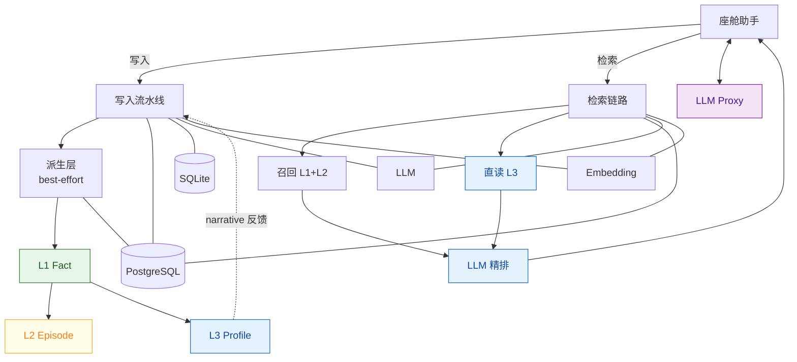
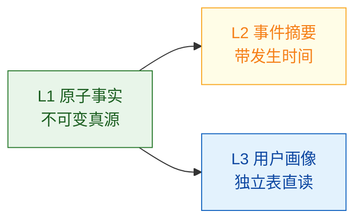

# 座舱记忆 2.0：我们在 Mem0 之上做了什么

> 基线：Mem0 OSS 2.0.18（arXiv:2504.19413，ECAI 2025）→ DesayMem `main@6d8ce4a`（2026-09-04）  
> 一句话：**Mem0 解决了"AI 助手该有记忆"，我们解决的是"车里的记忆该怎么设计"。**  
> 详细技术依据见 [TECHNICAL_REPORT.md](TECHNICAL_REPORT.md)

---

## 一、开篇：从通用助手到车内副驾

大模型的上下文窗口再大，会话一结束一切归零。用户上周说了空调喜欢 22 度，这周系统照样从头问起；用户说"老规矩"，系统完全不知道在说什么。这不是模型问题，是**记忆基础设施**问题。

Mem0 是当前这个赛道最受关注的开源方案——一篇 ECAI 2025 论文、六万加 GitHub star、LOCOMO 基准上比 OpenAI 原生记忆高 26%。我们认真评估并基于它构建了座舱长期记忆系统 DesayMem。

但把它放进车里之前，我们先回答了一个问题：**Mem0 的设计目标和我们的一样吗？**

不一样。Mem0 为开发者构建通用 AI 助手而设计；我们的用户每天在车里说的话是碎片化的、带情绪的、高度重复的，而且**大量查询不点名事物本身**——"去上次那家店""还是老样子""上周那次怎么回事"。

结论先行：**Mem0 的底座方向是对的，我们继承了它的核心机制；但它是一层"扁平的事实库"，车载场景需要的是一个"立体的记忆系统"。** 我们的改进全部围绕这一点展开。

---

## 二、Mem0 做对了什么，我们继承了什么

先讲清楚传承关系，避免让读者误以为我们推翻了 Mem0。恰恰相反，Mem0 论文中三个最重要的判断，我们都保留并工程化落地了：

| Mem0 的关键设计 | 为什么重要 | 我们的落地 |
|----------------|-----------|-----------|
| **选择性记忆**：LLM 从对话中提炼原子事实，只存要点不存原文 | 全量塞历史 = 高成本 + 低精度（full-context 每次 2.6 万 token） | 写入七步流水线：预处理 → LLM 抽取 → 去重 → 入库 → 实体链接 |
| **两阶段管线**：先提取、再对照近邻决定如何整合 | 防止记忆库无限膨胀、重复堆积 | Phase 1 向量召回近邻 top_k=10 作为抽取上下文，MD5 去重 |
| **混合检索思路**：语义相似度为主，兼顾结构化过滤 | 纯向量对精确词（人名/型号）召回不稳 | pgvector + BM25 双通道，且做了修复强化（见改进 4） |

技术上我们从 Mem0 OSS 2.0.18 的思路与部分实现**迁移重构**为独立代码库 `desaymem`，运行时不再依赖 `mem0ai` 包——既能持续吸收其演进，又不被上游版本绑架。

**但是。** 当我们拿真实的座舱语料去跑 Mem0 的原生结构时，三类失败反复出现——这就是下面要讲的三个不足。

---

## 三、Mem0 在车载场景的三个结构性不足

### 不足 1：偏好会被海量碎片淹没 ——「记不住」

Mem0 把所有记忆压成同一层原子事实片段，存在同一个向量空间里。用户一年积累几百上千条事实后，"空调喜欢 26 度"这样的稳定偏好，和"上周六去了趟公园"这样的一次性事实**同台竞争排序**。查询"用户平时喜欢什么温度"时，向量检索要在碎片堆里翻找——稳定偏好被稀释，命中靠运气。

Mem0 没有"画像"这个概念的一等公民地位。

### 不足 2：时间理解与指代消解基本为零 ——「想不起」

LOCOMO 基准的公开数据暴露了这个软肋：**OpenAI 原生记忆的 Temporal（时间推理）分项只有 21.71 分**（满分 100），因为记忆提取时根本不处理时间戳。Mem0 原版好一些（55.51），但其论文作者也承认要靠图版本 Mem0g 补时序能力——而图存储带来的正是 Mem0 自己宣称要避免的额外延迟和复杂度。

座舱里最典型的三类查询——"上周那次""我常去的那家店""老规矩"——分别考验相对时间换算、实体指代、习惯语义。**原生 Mem0 对这三类都没有针对性机制**，纯语义相似度无论怎么调参都无法把"上周"翻译成日期区间。

### 不足 3：更新即改写，历史即消失 ——「分不清」

Mem0 原版的整合机制是让 LLM 直接执行 ADD / UPDATE / DELETE 四操作决策。两个问题：

1. **改错即丢数据**——LLM 一次幻觉 DELETE，原始事实永久消失，无法审计、无法回滚；
2. **新旧共存竞争排序**——UPDATE 没触发时，"22 度"和"26 度"两条向量都躺在库里，检索时谁排前面看运气，下游拿到旧值的概率不低。

用户明明改了偏好，系统却像"分不清新旧"——这是体验上最恶劣的一类错误：**自信地给出过时答案**。

---

## 四、我们的改进：从一层扁平到三层立体

针对上面三个不足，我们没有修补，而是重构了记忆的表示层级。总览架构图：

> 绿 = L1 事实层（真源）　黄 = L2 事件层　蓝 = L3 画像层 + 精排　虚线 = 画像反馈闭环

### 改进 1【对应不足 1】：三层记忆模型——给"人是什么样"一个独立的座位

| 层 | 是什么 | Mem0 有没有 |
|----|--------|------------|
| **L1 Fact** | 原子事实，只增不改（ADD-only），永远保留 | 近似有，但可被 UPDATE/DELETE 改写 |
| **L2 Episode** | 一次连续经历的事件摘要，带绝对发生时间和证据 ID | **没有**——一次露营被拆成七八条孤立事实 |
| **L3 Profile** | "这个人现在是什么样"的结构化信念表 | **没有**——偏好只能混在事实堆里碰运气 |

关键设计决策：**L3 不进向量库**。独立表 `profile_beliefs`，按 `user_id` 主键 O(1) 直读，**每次检索结果必带画像字段**——稳定偏好从此不参与 HNSW 排序竞争，彻底解决"被稀释"。每条信念还带：

- `status`（active/superseded）：偏好变了不删旧行，标记取代，全程可审计；
- `stability`（一次性/习惯/身份）：区分"这次顺手开了窗"和"一贯喜欢开窗"；
- `conditions`：允许"夏天 22 度 + 冬天 26 度"共存，不是粗暴覆盖；
- `evidence_memory_ids`：每条画像都能点回到原始对话证据。

### 改进 2【对应不足 3】："LLM 提建议、Python 管写库"——把幻觉挡在数据库门外

Mem0 让 LLM 直接对记忆库执行增删改。我们把权力拆开：**LLM 只输出结构化建议 JSON，落库由 Python 校验后代执行**，两道硬校验：

1. 建议引用的证据 ID 必须真实存在于候选簇——防 LLM 编造来源；
2. 升级为"长期习惯"必须有 ≥2 个不同自然日的证据——防一次经历误判成人设。

配合 L1 的 ADD-only 不可变，得到 Mem0 给不了的性质：**任何上层错误都可以从 L1 全量重算重建**（L2/L3 都是派生层）。记忆系统最怕的不是漏记一条，而是错了没法查、查了没法修——这套机制让错误可发现、可追溯、可恢复。

### 改进 3【对应不足 3】：冲突消解——检索截断前先分清"谁更新了谁"

规则引擎三步定位偏好更新，在候选截断**之前**执行：

1. **更新表达检测**：13 类中文车机说法（"改成""从现在开始""不要 XX 了"）识别显式变更；
2. **属性分组**：空调/座椅/音乐/导航等同义归组，组内才比较；
3. **时序排序取最新**：按生效时间排序，新值 SUPERSEDE 旧值，旧值过滤不返回（仍在库中留审计），空出的位次由其他候选补位。

效果：用户说"从现在起空调 26 度"之后，检索"空调几度"**只可能拿到 26 度**——不再是新旧两条一起竞争排序。保守策略保证只在证据充分时才过滤，宁可多给不误杀。

### 改进 4【对应不足 2】：混合检索修复——关键词与语义取"并集"而非"主次"

Mem0 的检索以向量为主导。我们改为 pgvector over-fetch + BM25 关键词**双路并行、各自归一化、取并集**进统一打分：任一路强命中都不会掉出候选。精确型号、人名、数值这类低频词有了兜底通道。同时把时间衰减修正为真正的 30 天半衰期指数公式（原实现数学上不是半衰期）。

### 改进 5【对应不足 2】：实体链接——"那家店""老地方"有关联通道

写入时抽取专有名词/引号内容/主题词入实体表，同义词按向量 ≥0.95 自动合并（"公司"="单位"）；检索时 query 命中的实体为其关联记忆聚合加分（boost = 相似度 × 权重 × 热度）。多次提到过的餐厅、常去的充电站，即使查询不点名，也能通过实体通道浮上来。

值得说明：Mem0 2026 年 4 月的新版算法同样引入了内置实体链接——这反向验证了我们方向的正确；但我们在此基础上多了中文车机领域词典、通用属性词过滤（"空调""温度"不算实体）和同义合并阈值控制。

### 改进 6【对应不足 2】：LLM 语义精排——最后一步让模型"读懂"问题

规则打分之上叠加一次 LLM 精排，输入当前日期、查询、用户画像、候选记忆（假编号映射防 LLM 编造 ID），完成两件规则永远做不到的事：

- **相对时间换算**："上周那次" → 转成具体日期区间，过滤不在区间内的候选；
- **意图判别**："我空调一般开几度"（问当前偏好，以画像为准）vs "上周空调怎么回事"（问历史经历，翻事件记录）。

全链路容错：LLM 超时、输出非法 JSON、解析失败一律自动回退向量排序——**精排是增益项，永远不是可用性风险点**。

### 改进 7：车载领域适配与安全加固

- **十种车机属性的中文冲突词典**（空调、座椅、音乐、导航、音量、后视镜、车窗……）与模糊指令分层覆盖策略；
- **前后端分离 + LLM Proxy**：密钥不下发前端、API Key 鉴权、CORS 白名单、错误信息脱敏；
- **多租户 scope 校验**：修复 history 接口越权读取隐患。

---

## 五、我们如何验证：不引用厂商自报分数，自建年度评测

行业常识是供应商基准仅作参考（Mem0 自己公布 LOCOMO 92.5，第三方复测曾出现 30 分以上的落差）。所以我们不做数字搬运，而是**针对自己的场景建了自己的基准**：

| 要素 | 内容 |
|------|------|
| 数据集 | 495 段车机会话，横跨 **365 天**，含噪声话题与陷阱干扰项 |
| 用例 | 13 条：**5 条模糊查询**（"上周那次""老规矩""我常去的那家"…）+ **8 条常规画像查询**（"导航去公司""播放我最喜欢的音乐""空调默认几度"…） |
| 指标 | must_fact_recall（必达事实召回 ≥80% 判 PASS）、P@K、MRR、Top1 命中率、噪声率 |
| 诊断粒度 | 每个失败项区分**"根本没写入" vs "写了没召回"**——前者是抽取问题，后者是检索问题，改进方向完全不同 |
| 基线已测 | 未启用三层与精排的旧架构：模糊用例通过 **3/5**；两个 FAIL 项（偏好更新混淆、跨月事件召回）恰是改进 1/3/6 针对性解决的场景 |

下一步就是把同一评测集在新架构上完整回归，产出前后对比数据。

---

## 六、客观边界：我们知道自己在哪一层楼

对老板汇报不能只报喜。如实呈报：

**尚未收口的风险**（按优先级）：
- P0：并发写入下派生层缺事务锁——单实例部署下暂不构成实际问题，多副本前必须解决；
- P1：每次检索附加一次精排调用，P95 延迟与单轮 LLM 成本需建立预算控制和降级策略；
- P1：派生失败无自动补偿任务；SQLite 会话存储限制横向扩容；
- P2：批量导入历史数据时 L1 时间戳失真（修复方案已明确）；冲突词典覆盖面有限。

**当前定位**：功能验证与受控试点阶段（单实例、内网、可人工审计），完成 P0/P1 收口并通过 13 用例回归后，进入小流量车机试点。

**明确未覆盖**：知识记忆、技能蒸馏、主动服务、多模态记忆、端云同步——路线图项，不在本期。

---

## 七、总结：一张表看完差异

| 维度 | Mem0（OSS 2.0.18） | DesayMem（我们的改进） | 解决的痛点 |
|------|--------------------|------------------------|-----------|
| 记忆结构 | 单层扁平事实库 | L1 事实 / L2 事件 / L3 画像三层，派生层可重建 | 记不住 |
| 稳定偏好 | 与海量事实同台竞争向量排序 | 独立表主键直读，每轮检索必带 | 记不住 |
| 更新机制 | LLM 直接 UPDATE/DELETE，改错即丢 | LLM 建议 + Python 校验，ADD-only 可审计 | 分不清 |
| 新旧共存 | 无处理，靠排序运气 | 检索截断前冲突消解，只返回最新值 | 分不清 |
| 时间理解 | 无相对时间机制（Temporal 分项是各家短板区） | L2 绝对时间锚点 + LLM 精排时间换算 | 想不起 |
| 指代消解 | 无（新版有实体链接，我们另有多信号增强） | 实体链接 boost + BM25 并集 + narrative 反馈 | 想不起 |
| 检索范式 | 向量主导 | 双路并集 + 组合打分 + 语义精排，全程容错回退 | 想不起 |
| 场景适配 | 通用英语助手 | 中文车机领域词典、多租户隔离、Proxy 安全加固 | — |
| 验证方式 | 引用公开基准（LOCOMO 等） | 自建 365 天 / 13 用例车载年度评测，含根因区分 | — |

**收口三句话：**

1. 我们尊重并继承了 Mem0 的核心洞察——选择性记忆、两阶段管线、混合检索；
2. 我们指出了它在车载场景的真实缺口——扁平结构装不下"偏好、经历、时间"这三种维度的记忆，并用三层架构 + 四项检索增强逐条补齐；
3. 系统的定位已经改变：从"能存、能搜的记忆库"，升级为"能描述一段经历、能形成当前画像、能在模糊指代下准确想起"的**车载记忆底座**——这是我们自己的评测体系正在量化验证的目标。
