# DesayMem_mem0 车载助手三层长期记忆系统技术方案

> 版本基线：`main` 分支 `5107421`（2026-09-07）  
> 文档用途：技术汇报  
> 关键词：车载记忆、三层记忆架构、L1/L2/L3、Mem0 迁移、pgvector 混合检索、记忆可观测性  
> 架构图集：[architecture_diagram.html](architecture_diagram.html)（浏览器打开可交互查看 6 张分页架构图）

---

## 一、系统定位

DesayMem_mem0 是德赛西威面向座舱助手的云端长期记忆系统，从 Mem0 OSS 2.0.18 思路与部分实现迁移重构，使用独立的 `desaymem` 命名空间，运行时不依赖 `mem0ai` 包。

**要解决的核心问题：**

| 痛点 | 表现 |
|------|------|
| 记不住 | 跨会话遗忘用户偏好（上次说了空调 22 度，下次又问） |
| 想不起 | 模糊查询命中不了（"上次那次""老规矩"找不到） |
| 分不清 | 一次经历被拆碎、稳定偏好和临时事实混在同一向量空间 |

**技术栈：** Python 3.10+ / FastAPI / PostgreSQL 16 + pgvector / SQLite / OpenAI 兼容 LLM (Qwen/DeepSeek) + Embedding (BGE-M3)

**架构分层：**

```
api → services → core → {providers, stores}
```

`DesayMemory` 是中心编排器，组装抽取器、检索器、实体链接器、事件构建器、画像蒸馏器和精排器。
```
src/desaymem/
├── api/routes/memories.py      ← 六章API表全部路由
├── services/memory_service.py  ← 业务门面，转发到core
├── core/
│   ├── memory.py               ← 二章写入七步 + 三章L2/L3派生 + 四章检索编排 + 三点五审计注入
│   ├── config.py               ← 配置参数(rerank_candidate_limit=32等)
│   ├── models.py               ← 五章数据模型(StoredMemory/StoredBelief/ProfileView)
│   ├── enums.py                ← MemoryType枚举
│   └── prompts.py              ← 抽取/精排/蒸馏所有LLM提示词
├── extraction/
│   ├── extractor.py            ← 二章Step2 LLM ADD-only抽取
│   ├── dedup.py                ← 二章Step3 MD5去重
│   └── entity_linker.py        ← 二章Step6 + 四章4.5实体链接
├── retrieval/
│   ├── retriever.py            ← 四章4.1十阶段编排
│   ├── scoring.py              ← 四章4.2组合打分公式
│   ├── conflict_resolution.py  ← 四章4.4冲突消解6步
│   └── reranker.py             ← 四章4.6 LLM精排
├── layers/
│   ├── episode_builder.py      ← 三章3.3 L2事件形成
│   ├── distiller.py            ← 三章3.4 L3画像蒸馏
│   └── reranker.py             ← (同retrieval/reranker或独立?)
├── providers/
│   ├── llm.py                  ← OpenAI兼容LLM调用
│   └── embedding.py            ← BGE-M3 embedding
├── stores/
│   ├── base.py                 ← Protocol定义(MemoryStore/ProfileStore/AuditStore)
│   ├── pgvector.py             ← PostgreSQL实现 + _row_to_memory
│   ├── profile.py              ← profile_beliefs实现 + _row_to_belief
│   ├── audit.py                ← 三点五 safe_append审计
│   ├── sqlite_history.py       ← SQLite会话消息+变更历史
│   └── __init__.py             ← 导出
---
```

## 二、总体架构图

### 2.1 系统全景：写入七步 + L1→L2→L3 派生 + 检索召回拼接

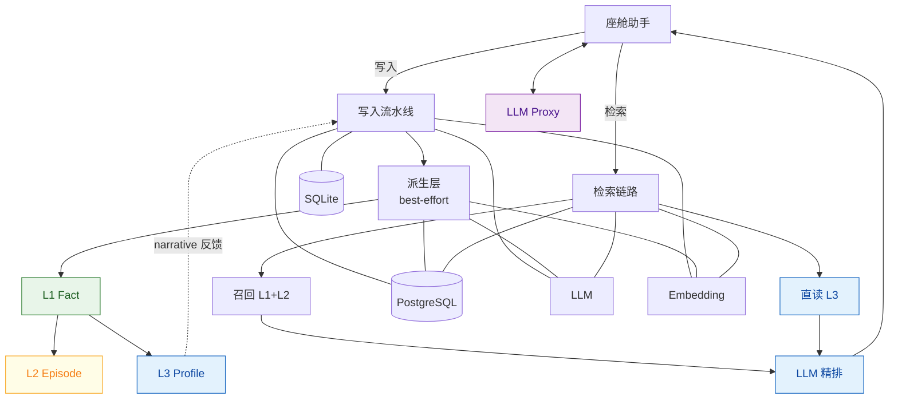

**图例说明：**

- **绿色** = L1 事实层（真源，ADD-only 不可变）
- **黄色** = L2 事件层（从 L1 派生，可重建）
- **蓝色** = L3 画像层（独立表存储）+ LLM 精排（语义判断+时间换算）
- **紫色** = LLM Proxy（对话生成，独立于记忆 API）
- 实线 = 数据写入 / 查询路径
- 虚线 = 反馈回路（L3 narrative → 下轮写入 Summary）

**写入七步（代码 `memory.py::add` 对应）：**

| 步骤 | 代码 Phase | 做什么 | 调用谁 |
|------|------------|--------|--------|
| Step 0 | 预处理 | 解析消息 + 读 last_k + 读 L3 画像 | SQLite messages + PG profile |
| Step 1 | Phase 1 | 向量召回已有近邻 top_k=10 | Embedding + pgvector |
| Step 2 | Phase 2 | LLM ADD-only 抽取原子事实 | LLM |
| Step 3+4 | Phase 3-5 | 批量 embedding + MD5 去重 | Embedding + PG hash |
| Step 5 | Phase 6 | 写入 L1 memory_items + history | PG + SQLite |
| Step 6 | Phase 7 | 实体抽取与链接 | PG entities |
| Step 7 | 收尾 | 保存会话消息 → 触发 L2/L3 派生 | SQLite + L2/L3 builder |

**L1→L2→L3 派生链：**

```
L1 入库成功
  ├─→ EpisodeBuilder: 读 active episode + 新事实 + 消息 + 时间 + 相似度
  │     → LLM 判断 continues/new → 写 L2 (source_memory_ids 指回 L1)
  │
  └─→ ProfileDistiller: L1 + 向量近邻 → 证据簇
        → LLM 输出 beliefs → Python 校验 → 写 L3 (evidence_ids 指回 L1)
        → active beliefs 拼成 narrative → 反馈到下一轮 Step 0
```

**通俗案例：用户说了句"我开车时空调调到 22 度，放点爵士乐"**

假设这是用户第一次和车机对话，系统里没有任何历史记忆。

**Step 0~5 写入 L1：** LLM 从这句话抽取出两条原子事实：

| L1 ID | 内容 | occurred_at |
|-------|------|-------------|
| `l1-a` | 用户开车时喜欢空调 22 度 | 2026-09-04T10:00 |
| `l1-b` | 用户开车时听爵士乐 | 2026-09-04T10:00 |

两条 L1 写入 `memory_items` 成功后，**Step 6 实体链接**先执行——

**Step 6 实体链接：**

```
entity_linker.link_memories([l1-a, l1-b], scope)

l1-a "用户开车时喜欢空调 22 度"
  → extract_entities 扫描文本
  → "开车"在 _GENERIC_CJK 中被过滤（通用动词，不是实体）
  → "空调"在 _GENERIC_CJK 中被过滤（属性词，不是实体）
  → "22 度"是数值不是实体
  → 结果：无实体可链接，跳过

l1-b "用户开车时听爵士乐"
  → extract_entities 扫描文本
  → "开车"被过滤
  → "爵士乐"不是通用词 → 抽取为 TOPIC 类型实体
  → normalize_entity_text("爵士乐") = "爵士乐"
  → 生成 embedding
  → 查实体库：无精确匹配，cosine 搜索也无 ≥ 0.95 的
  → 插入新实体 e-1: {text:"爵士乐", type:"TOPIC", linked_memory_ids:["l1-b"]}
```

实体库现在的状态：

```
memory_entities:
┌────────┬────────────┬──────────────┬───────────────────┐
│ id     │ entity_text│ entity_type  │ linked_memory_ids │
├────────┼────────────┼──────────────┼───────────────────┤
│ e-1    │ 爵士乐     │ TOPIC        │ ["l1-b"]          │
└────────┴────────────┴──────────────┴───────────────────┘
```

**为什么 l1-a 没有实体链接？** 因为"空调""温度""开车"都在 `_GENERIC_CJK` 过滤集合里（`entities.py:40-56`）。这些是属性词和通用动词，不是命名实体。实体链接的目的是建立"导航去公司"→"公司"、"听爵士乐"→"爵士乐"这类实体级别的关联，而不是给每个词都建链接。

**如果过几天用户又说"从现在开始空调改成 26 度"：**

```
→ Step 2 LLM 抽取 L1: l1-c "用户将空调改为 26 度"
→ Step 6 实体链接:
    l1-c "用户将空调改为 26 度"
      → "空调"被过滤
      → "26 度"是数值
      → 无实体可链接

  但如果用户说的是"导航去公司":
  → "公司"不在 _GENERIC_CJK 中 → 抽取为 TOPIC 实体
  → 插入 e-2: {text:"公司", linked:["新L1"]}
  → 以后用户说"开车到单位"时，cosine("单位","公司") ≥ 0.95 → 合并到 e-2
  → 检索"导航去公司"时，e-2 的 linked_memory_ids 里的 L1 都拿到 entity_boost
```

然后触发派生层构建——

**分支 A：EpisodeBuilder 构建事件层 L2**

```
系统发现此 scope 没有 active episode（第一次对话）
  → LLM 看到：无开放事件 + 两条新事实 + 消息 + 时间
  → LLM 判断：continues=false（没有旧事件可续），新建一个 episode
  → LLM 输出摘要："用户在驾车时设置了空调温度并选择听爵士乐"
  → Python 从 L1 证据推导时间：
      occurred_at  = min(l1-a.occurred_at, l1-b.occurred_at) = 10:00
      occurred_end = max(l1-a.occurred_at, l1-b.occurred_at) = 10:00
  → 写入 L2：
      content = "用户在驾车时设置了空调温度并选择听爵士乐"
      source_memory_ids = ["l1-a", "l1-b"]   ← 指回 L1
      occurred_at = "2026-09-04T10:00:00+08:00"
```

此时 L2 是一条"那次操作"的事件摘要，和 L1 存在同一张表，参与向量召回。

**分支 B：ProfileDistiller 构建画像层 L3**

```
系统用 l1-a 和 l1-b 做向量近邻检索 → 只有这两条本身（第一次对话，没有历史）
  → 证据簇 = {l1-a, l1-b}
  → LLM 看到证据，输出两条 belief 建议：
      ① attribute=空调温度, value=22度, stability=recurring, evidence_ids=[l1-a]
      ② attribute=音乐偏好, value=爵士乐, stability=recurring, evidence_ids=[l1-b]
  → Python 校验：
      ① evidence_ids 中的 l1-a 确实在簇内 ✓
         但 recurring 要求 ≥2 个不同自然日证据，只有 1 条 → 降级为 episode
      ② 同理，l1-b 只有 1 条证据 → 降级为 episode
      （注意：降级 ≠ 丢弃。LLM 返回 NOOP 才不写入；
       recurring 降为 episode 只是降低置信等级，仍然写入 L3。
       因为用户刚说了"空调 22 度"就是一条有效当前观察，
       下一轮抽取 Prompt 的 Summary 槽需要带上这个信息。
       等将来第二次不同日期出现同样证据时，可通过 CONFIRM 升级为 recurring。）
  → 写入 L3：
      belief-1: 空调温度=22度, status=active, stability=episode, evidence=[l1-a]
      belief-2: 音乐偏好=爵士乐, status=active, stability=episode, evidence=[l1-b]
  → 拼接 narrative 快照：
      "User 空调温度: 22度\nUser 音乐偏好: 爵士乐"
  → 这个 narrative 反馈到下一轮 add 的 Step 0，
    下次用户说话时，LLM 抽取事实的 Prompt 里就带上了"已知这个人空调 22 度、听爵士乐"
```

**如果过几天用户又说"从现在开始空调改成 26 度"：**

```
→ Step 2 LLM 抽取 L1: l1-c "用户将空调改为 26 度"
→ L2 EpisodeBuilder: LLM 判断 continues=false（话题变了），旧 episode 关闭，新开一个
→ L3 ProfileDistiller:
    证据簇 = {l1-c} + 向量近邻命中 {l1-a}（语义相似）
    LLM 输出: attribute=空调温度, value=26度, decision=SUPERSEDE, evidence=[l1-c]
    Python 校验 l1-c 在簇内 ✓
    执行 SUPERSEDE:
      belief-1 (22度) → status 改为 superseded（不删除，保留审计）
      新建 belief-3: 空调温度=26度, status=active, evidence=[l1-c]
    更新 narrative: "User 空调温度: 26度\nUser 音乐偏好: 爵士乐"

→ 下次用户问"我空调一般开多少度"，检索时：
    L3 画像直接说 26 度（active），22 度那条是 superseded 不会返回
    L1 里 l1-a (22度) 和 l1-c (26度) 都在，但冲突消解会过滤掉 l1-a
```

**一句话总结三层关系：** L1 是"说了什么"的原始记录，L2 是"那次做了什么"的事件回顾，L3 是"这个人现在是什么样"的当前画像——查询时 L3 始终附带（不靠向量），L1+L2 靠语义召回，三层各司其职。

**检索召回拼接链：**

```
用户查询
  → 向量召回 L1+L2（同表 over-fetch）
  → BM25 关键词召回（与语义取并集）
  → 组合打分 + 冲突消解（过滤 superseded 旧值）
  → L2 证据展开（source_memory_ids → 拉同 scope L1 入精排池）
  → 附加 L3 画像（主键直读，不走向量）
  → LLM 精排（输入: query + 日期 + 画像 + 候选 L1+L2+展开L1）
  → 返回 { memories: top_k, profile: L3 画像 }
```

### 2.2 三层记忆模型

```mermaid
flowchart LR
    subgraph L1["L1 Fact — 事实真源"]
        L1A[原子事实 A<br/>"用户喜欢空调 22 度"]
        L1B[原子事实 B<br/>"用户去了公园"]
        L1C[原子事实 C<br/>"用户改为 26 度"]
        L1D[原子事实 D<br/>"用户常听爵士乐"]
    end

    subgraph L2["L2 Episode — 事件摘要"]
        E1["去公园的经历<br/>occurred_at: 08-28T15:30"]
        E2["空调偏好调整<br/>occurred_at: 09-01T10:00"]
    end

    subgraph L3["L3 Profile — 当前画像"]
        P1["空调温度: 26度<br/>status: active<br/>stability: recurring"]
        P2["音乐偏好: 爵士乐<br/>status: active<br/>stability: recurring"]
        P3["空调温度: 22度<br/>status: superseded"]
    end

    L1A -.->|派生| P3
    L1C -.->|SUPERSEDE| P1
    L1C -.->|派生| P1
    L1D -.->|派生| P2
    L1B -.->|聚合| E1
    L1A -.->|聚合| E2
    L1C -.->|聚合| E2

    style L1 fill:#e8f5e9,stroke:#2e7d32
    style L2 fill:#fff3e0,stroke:#ef6c00
    style L3 fill:#e3f2fd,stroke:#1565c0
    style P3 fill:#ffcdd2,stroke:#c62828
```

| 层级 | 语义 | 存储位置 | 查询方式 | 可重建性 |
|------|------|----------|----------|----------|
| **L1 Fact** | 自包含原子事实 | `memory_items`, `memory_type=semantic_memory` | 向量 + BM25 + 实体 + 时间 | 真源 |
| **L2 Episode** | 一次连续经历的事件摘要 | **同一张** `memory_items`, `memory_type=episodic_memory` | 与 L1 一起向量召回 | 可由 L1 重建 |
| **L3 Profile** | 当前有效的身份、偏好和习惯 | **独立表** `profile_beliefs` | 按 `tenant_id + user_id` 主键直读 | 可由 L1/L2 重建 |

**三条核心设计原则：**

1. **L1 是唯一事实真源** — 所有写入不可变（ADD-only），旧值不物理覆盖
2. **L2/L3 可从 L1 重建** — 派生层失败不回滚 L1，best-effort
3. **LLM 只提建议，Python 管写库** — LLM 输出结构化 JSON，Python 校验证据后执行写操作

---

## 三、写入链路

### 3.1 标准语义写入流程（infer=true）

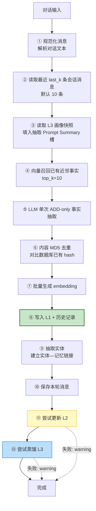

**关键设计：** 步骤 ⑪⑫ 失败只记录 warning，**不回滚已成功的 L1**。保证基础事实始终可用，但三层短时间可能不一致。

### 3.2 其他写入模式

| 模式 | 行为 |
|------|------|
| `infer=false` | 消息原文直接入库，不调 LLM |
| `memory_type=procedural_memory` | 用过程记忆 Prompt 生成步骤摘要后入库 |
| L1 ADD-only | 更新不物理覆盖旧事实，旧值通过检索期冲突消解处理 |

### 3.3 L2 事件形成

#### L1 与 L2 有什么不同

L1 和 L2 存在同一张 `memory_items` 表里，但语义完全不同：

| | L1 Fact | L2 Episode |
|---|---------|------------|
| **存什么** | 一句话能说完的原子事实 | 一次完整经历的概括摘要 |
| **粒度** | "用户喜欢空调 22 度" | "用户在驾车途中设置了空调温度并选了爵士乐，随后将温度调高到 26 度" |
| **memory_type** | `semantic_memory` | `episodic_memory` |
| **可变吗** | 不可变，ADD-only | 可变，continues=true 时更新摘要和向量 |
| **metadata** | `observed_at`, `occurred_at` | `episode_status`, `source_memory_ids`, `occurred_at`, `occurred_end`, `confidence` |
| **时间** | 事实发生时间 | 事件开始~结束时间（从 L1 证据取 min/max） |
| **指回关系** | 无 | `source_memory_ids` 指向所属的 L1 |

**举例：用户在一次 20 分钟驾乘中说了三句话**

```
10:00  "空调调到 22 度"
10:10  "放点爵士乐"
10:20  "有点冷，改成 26 度"
```

经过三轮 add 后，`memory_items` 表里的实际数据：

```
─── L1 事实（3 条，每条不可变）──────────────────────────────
id: l1-a  memory_type: semantic_memory
content: "用户开车时喜欢空调 22 度"
embedding: [0.12, -0.05, ...]  ← 对这句话单独编码
metadata: { observed_at: "10:01", occurred_at: "10:00" }

id: l1-b  memory_type: semantic_memory
content: "用户开车时听爵士乐"
embedding: [0.08, 0.31, ...]
metadata: { observed_at: "10:11", occurred_at: "10:10" }

id: l1-c  memory_type: semantic_memory
content: "用户将空调从 22 度改为 26 度"
embedding: [0.14, -0.03, ...]
metadata: { observed_at: "10:21", occurred_at: "10:20" }

─── L2 事件摘要（1 条，三轮逐渐续写）────────────────────────
id: ep-1  memory_type: episodic_memory
content: "用户在驾车途中先设置空调 22 度并选了爵士乐，后因冷调高到 26 度"
embedding: [0.22, 0.15, ...]  ← 对整段摘要编码，和 L1 不是同一个向量
metadata: {
    episode_status: "active",
    source_memory_ids: ["l1-a", "l1-b", "l1-c"],  ← 指回 L1
    occurred_at:  "2026-09-04T10:00:00+08:00",    ← min(l1-a,b,c)
    occurred_end: "2026-09-04T10:20:00+08:00",    ← max(l1-a,b,c)
    confidence: 0.88
}
```

**关键区别：**

1. **L1 是"说了什么"，L2 是"那次经历了什么"** — 查"空调多少度"匹配 L1，查"上次开车那次"匹配 L2
2. **L1 的 embedding 是单句编码，L2 的 embedding 是整段摘要编码** — 两者在同一个 HNSW 索引里，但向量空间位置不同
3. **L2 的 `source_memory_ids` 是桥梁** — 命中 L2 后可以反向拉回它包含的所有 L1 证据

#### 检索时 L1 和 L2 如何一起召回

代码 `pgvector.py:417-428` 的向量检索 SQL：

```sql
SELECT id, ..., memory_type, content, embedding <=> %s::vector AS distance
FROM memory_items
WHERE tenant_id = %s AND user_id = %s
    {extra}
ORDER BY distance
LIMIT %s
```

**注意 WHERE 条件只有 `tenant_id + user_id`，没有按 `memory_type` 过滤。** 所以同一次检索中，L1 的 `semantic_memory` 行和 L2 的 `episodic_memory` 行都会参与 cosine 排序，一起返回。

以查询"上次开车空调调了几次"为例：

```
向量召回返回（按 cosine distance 排序）：
  1. ep-1 (L2)  distance=0.15  ← 摘要含义最接近"开车调空调"
  2. l1-c (L1)  distance=0.28  ← "改为 26 度"也相关
  3. l1-a (L1)  distance=0.31  ← "22 度"也相关
  4. l1-b (L1)  distance=0.45  ← 爵士乐稍远

→ L2 排第一名，因为摘要"驾车途中空调从 22 调到 26 度"
  整体语义比任何单条 L1 更接近查询意图

→ 命中 ep-1 后，_expand_episode_evidence 按 source_memory_ids
  把 l1-a、l1-b、l1-c 全部拉入精排池
  → LLM 精排看到：1 条 L2 整段经历 + 3 条 L1 具体事实
  → 能回答"调了两次，先 22 度后 26 度"
```

BM25 关键词检索（`pgvector.py:470-473`）同理，也对全表做 `to_tsvector` 匹配，不区分 `memory_type`。L1 和 L2 的 `text_lemmatized` 都参与全文检索。

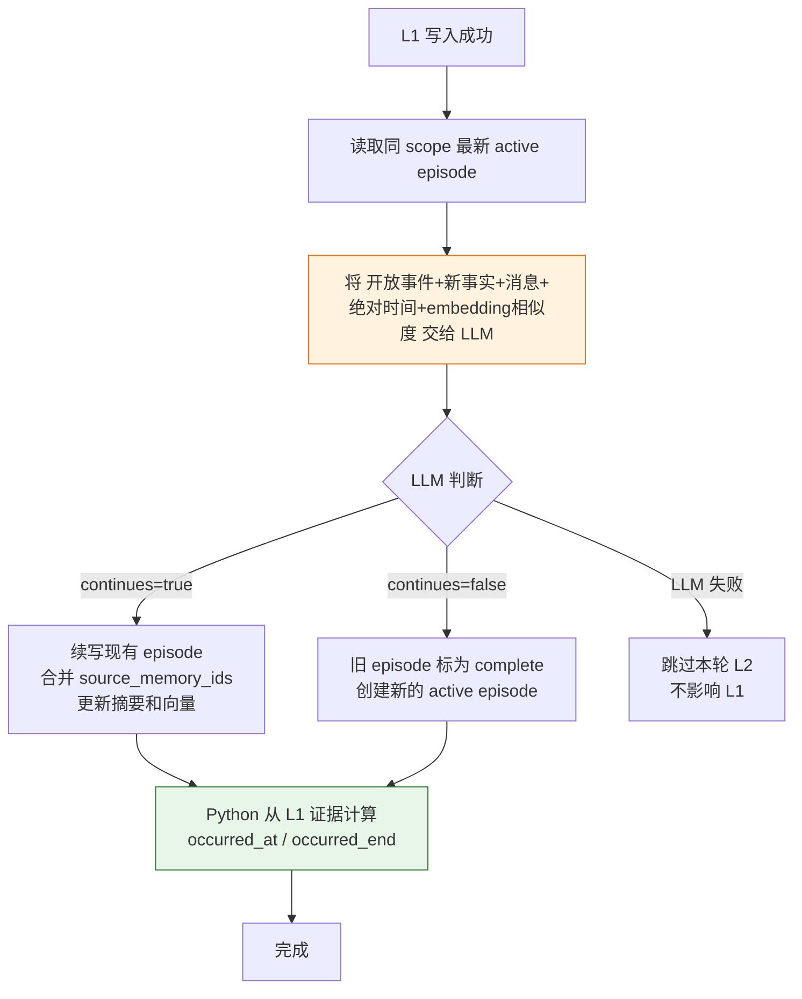

**L2 续写过程（对应上面三轮对话）：**

```
第 1 轮 (10:00)：
  无 active episode → LLM 判断 continues=false → 新建 ep-1
  ep-1.content = "用户设置了空调 22 度"
  source_memory_ids = [l1-a]

第 2 轮 (10:10)：
  有 active episode (ep-1) → LLM 判断 continues=true → 续写
  ep-1.content = "用户设置了空调 22 度并选了爵士乐"
  source_memory_ids = [l1-a, l1-b]
  occurred_end 更新为 10:10

第 3 轮 (10:20)：
  有 active episode (ep-1) → LLM 判断 continues=true → 续写
  ep-1.content = "用户驾车时先设空调 22 度并选了爵士乐，后调高到 26 度"
  source_memory_ids = [l1-a, l1-b, l1-c]
  occurred_end 更新为 10:20
  ← 每次续写都重新生成 embedding，所以 ep-1 的向量也在变化
```

**时间处理关键规则：**

- L2 摘要只描述"发生了什么"，**不固化相对时间**
- `occurred_at`（事件开始）和 `occurred_end`（最新观察）由 Python 从 L1 证据 metadata 计算（`memory.py:688`：`_episode_time_bounds` 取 min/max）
- Prompt 明确禁止 LLM 使用"上周""昨天""前几天"等相对表达
- 查询时的"上周"由精排 LLM 根据当前日期 + 候选绝对时间戳计算

**并发约束（`005_episode_integrity.sql`）：**

```sql
-- 保证同一 scope 最多一条 active episode
CREATE UNIQUE INDEX IF NOT EXISTS uq_memory_active_episode_scope
    ON memory_items (tenant_id, user_id, occupant_id)
    WHERE memory_type = 'episodic_memory'
      AND COALESCE(metadata->>'episode_status', 'active') = 'active';
```

#### 模糊查询时 L2 怎么起作用

L2 存在的核心价值就是回答模糊查询。L1 是碎片化的单条事实，当用户问"上次那次""前几天那个"时，任何单条 L1 都匹配不好——但 L2 把一次经历的多个 L1 聚合成了一段摘要，整段摘要的语义正好能匹配模糊查询。

**场景：用户过了一周后问"上周开车那次空调怎么回事"**

假设上周那次驾乘（10:00~10:20）产生的数据还在：

```
L1:
  l1-a "用户开车时喜欢空调 22 度"          occurred_at: 09-04 10:00
  l1-b "用户开车时听爵士乐"              occurred_at: 09-04 10:10
  l1-c "用户将空调从 22 度改为 26 度"     occurred_at: 09-04 10:20

L2:
  ep-1 "用户驾车时先设空调 22 度并选了爵士乐，后调高到 26 度"
       occurred_at: 09-04 10:00  occurred_end: 09-04 10:20
       source_memory_ids: [l1-a, l1-b, l1-c]
```

查询 `"上周开车那次空调怎么回事"` 的完整检索链路：

```
① 向量召回（pgvector，L1+L2 同表一起检索）
   query embedding 编码"上周开车那次空调怎么回事"整句

   返回（按 cosine distance 排序）：
     1. ep-1 (L2)  distance=0.12  ← 摘要整段语义最匹配"开车那次空调"
     2. l1-c (L1)  distance=0.35  ← "改为 26 度"部分相关
     3. l1-a (L1)  distance=0.38  ← "22 度"部分相关
     4. l1-b (L1)  distance=0.52  ← 爵士乐不太相关

   为什么 ep-1 排第一？
   因为 ep-1 摘要 = "驾车时先设空调 22 度并选了爵士乐，后调高到 26 度"
   这个整句和"上周开车那次空调怎么回事"的语义距离，
   比任何一条碎片化的 L1 都近。
   单条 l1-a "喜欢空调 22 度" 无法体现"那次经历了什么"，
   但 ep-1 的摘要完整描述了整个过程。

② BM25 关键词召回（与语义取并集）
   "开车""空调" 关键词也命中 ep-1 和 l1-a、l1-c

③ 组合打分 + 冲突消解
   ep-1 综合分最高
   l1-a（22度）和 l1-c（改为26度）冲突消解：l1-c 是 update，l1-a 被过滤

④ L2 证据展开（_expand_episode_evidence，memory.py:831-861）
   ep-1 命中后，按 source_memory_ids 把 l1-a、l1-b、l1-c 拉入精排池
   → 精排池现在有：
       ep-1 (L2 整段经历)
       l1-a (L1: 22度，但已被冲突消解过滤)
       l1-b (L1: 爵士乐)
       l1-c (L1: 改为26度)
   → L2 负责"找到那次经历"，L1 负责"提供具体事实"

⑤ 附加 L3 画像（主键直读）
   当前画像: 空调温度=26度 active

⑥ LLM 语义精排（reranker.py，输入全部候选 + 当前日期 + 画像）
   精排 LLM 收到：
     query: "上周开车那次空调怎么回事"
     当前日期: 2026-09-11
     候选:
       ep-1  occurred_at: 09-04  ← LLM 计算：9月4日确实在上周 ✓
       l1-c  "用户将空调从 22 度改为 26 度"
       l1-b  "用户开车时听爵士乐"

   精排 LLM 做两件事：
   a. 时间换算：当前 09-11，"上周"→ 09-04 ~ 09-10
      ep-1.occurred_at = 09-04 落在窗口内 ✓
   b. 选择：ep-1 + l1-c 最能回答"空调怎么回事"

   ← 下面详细解释时间是怎么起作用的 ──────────────────────

   【精排 LLM 的实际输入】（reranker.py:41-57 拼装）

   system prompt（prompts.py RERANK_SYSTEM_PROMPT）关键指令：
   "Candidate timestamps are absolute event times. Resolve query-relative
    phrases such as 'last week' or '上周' at query time from today's date
    and those timestamps; never assume that such a phrase was stored as
    part of an episode."
   ↑ 告诉 LLM：候选里的 occurred_at 是绝对时间，
     "上周"这种相对时间由你根据当前日期换算，不要假设它被存在摘要里。

   user prompt 实际内容（JSON）：
   ┌──────────────────────────────────────────────────────┐
   │ ## Current date                                      │
   │ 2026-09-11                                           │
   │                                                      │
   │ ## Query                                             │
   │ 上周开车那次空调怎么回事                                │
   │                                                      │
   │ ## Profile                                           │
   │ {"narrative": "User 空调温度: 26度", "beliefs": [...]}│
   │                                                      │
   │ ## Candidates                                        │
   │ [                                                    │
   │   {"id":"0", "layer":"episodic_memory",             │
   │    "text":"用户驾车时先设空调22度并选了爵士乐，后调高到26度",│
   │    "occurred_at":"2026-09-04T10:00:00+08:00",       │
   │    "score":0.82},                                   │
   │   {"id":"1", "layer":"semantic_memory",             │
   │    "text":"用户将空调从22度改为26度",                  │
   │    "occurred_at":"2026-09-04T10:20:00+08:00",       │
   │    "score":0.35},                                   │
   │   {"id":"2", "layer":"semantic_memory",             │
   │    "text":"用户开车时听爵士乐",                       │
   │    "occurred_at":"2026-09-04T10:10:00+08:00",       │
   │    "score":0.52}                                    │
   │ ]                                                    │
   └──────────────────────────────────────────────────────┘

   【LLM 输出】：
   {
     "selected_ids": ["0", "1"],
     "time_scope": {"from": "2026-09-04", "to": "2026-09-10"}
   }

   【时间换算的具体过程】：
   1. LLM 读到 Current date = 2026-09-11（周五）
   2. query 含"上周" → LLM 自己换算：
      2026-09-11 往前推一周 → 上周 = 09-04(周一) ~ 09-10(周日)
   3. 逐个检查候选的 occurred_at：
      ep-1: 09-04T10:00 → 在 09-04~09-10 窗口内 ✓
      l1-c: 09-04T10:20 → 在窗口内 ✓
      l1-b: 09-04T10:10 → 在窗口内 ✓
   4. 但 l1-b 是爵士乐，和"空调怎么回事"不相关 → 不选
      ep-1 是整段经历摘要，包含空调变化过程 → 选
      l1-c 是具体事实"22改26"，补充细节 → 选
   5. 输出 selected_ids=["0","1"]，time_scope 标注了换算出的窗口

   【为什么不在存储时就写好"上周"？】
   因为"上周"是查询时的相对概念，存储时不知道将来什么时候被查。
   - 09-04 写入时写"上周"，到 09-18 查就成了"两周前"，语义错误
   - 绝对时间 09-04 是不变的，每次查询时由精排 LLM 结合当前日期换算
   - 这就是 L2 摘要禁止出现"上周/昨天/前几天"、只保存 occurred_at 的原因

   【如果没有精排 LLM 换算会怎样？】
   向量召回按 cosine distance 排序时，不知道"上周"是什么时间范围。
   它只看语义相似度——可能把上周的 ep-1 排第一，也可能把上个月的
   ep-2 排第一（如果 ep-2 的摘要和"开车空调"语义更接近）。
   精排 LLM 拿到当前日期 + 绝对时间戳后，能明确排除时间不符的候选，
   只选落在"上周"窗口内的。这是向量检索做不到的。

⑦ 返回
   memories: [ep-1 (L2), l1-c (L1)]
   profile: { 空调温度: 26度 }

   → 前端 / LLM Proxy 拿到后可以回答：
     "上周那次您先设了 22 度，后来觉得冷改成了 26 度，现在记忆里是 26 度"
```

**为什么 L1 单独做不到？**

| 模糊查询 | 单看 L1 | 有 L2 |
|----------|---------|-------|
| "上周那次" | L1 是碎片，每条只知道一个点，不知道"那次"包含哪些 | L2 摘要用一句话概括了整次经历，`occurred_at` 有绝对时间可换算 |
| "空调怎么回事" | l1-a 和 l1-c 各说一个温度，需要人工拼接才知道"先 22 后 26" | L2 摘要已经写了"先设 22 度后调高到 26 度" |
| "那次还做了什么" | 向量只召回空调相关 L1，爵士乐的 l1-b 排第 4 可能被截断 | L2 命中后 `source_memory_ids` 把 l1-b 也拉进精排池，不遗漏 |

一句话：**L2 是"那次经历了什么"的语义入口，L1 是"具体事实是什么"的证据底料。模糊查询靠 L2 整段语义命中，具体回答靠 L1 碎片提供细节。**

### 3.4 L3 画像蒸馏

#### 原理与设计核心

L1 和 L2 都在 `memory_items` 表里参与向量召回。问题来了：一年下来一个用户可能积累几百上千条 L1，稳定偏好（"空调喜欢 26 度""导航常去公司"）和一次性事实（"上周去了趟公园"）混在一起。查"用户平时喜欢什么"时，向量检索会在海量碎片里翻找，稳定偏好被稀释。

**L3 的设计核心：把"这个人现在是什么样"从向量库里拎出来，单独存一张结构化表，按主键直读，不走向量检索。**

| 设计决策 | 原因 |
|----------|------|
| 独立表 `profile_beliefs`，不存 `memory_items` | 稳定画像不和海量 L1 竞争 HNSW 排序 |
| 按 `tenant_id + user_id` 主键直读 | O(1)，不需要 cosine top-k |
| 有 `status` 字段（active/superseded） | 偏好变了不删旧行，标 superseded 保留审计 |
| 有 `stability` 字段（episode/recurring/identity） | 区分"一次性的"和"长期习惯" |
| 有 `evidence_memory_ids` 指回 L1 | 每条信念可追溯到原始事实 |
| `attribute_embedding` 只用于蒸馏时合并同义信念 | **不参与用户查询的主召回** |
| 有 `conditions` JSONB | "夏天空调 22 度"和"冬天空调 26 度"可以 COEXIST |

**LLM 提建议，Python 管写库**——LLM 输出 JSON belief（含 attribute、value、decision、evidence_ids），Python 做两道校验后执行写操作：

1. 证据 ID 必须在簇内真实 L1 上（防幻觉）
2. recurring 必须有 ≥2 个不同自然日证据（防一次经历误判为习惯）

#### 数据库存储格式

`profile_beliefs` 表（`004_layers.sql`）：

```sql
CREATE TABLE IF NOT EXISTS profile_beliefs (
    id UUID PRIMARY KEY DEFAULT gen_random_uuid(),
    tenant_id TEXT NOT NULL,
    user_id TEXT NOT NULL,
    occupant_id TEXT NOT NULL DEFAULT 'primary',
    subject TEXT NOT NULL DEFAULT 'User',
    attribute TEXT NOT NULL,         -- 自然语言 key，如"空调温度"
    value TEXT NOT NULL,             -- 如"26度"
    conditions JSONB DEFAULT '{}',   -- 如{"season":"夏天"}
    stability TEXT DEFAULT 'episode',-- episode | recurring | identity
    status TEXT DEFAULT 'active',    -- active | superseded
    confidence REAL DEFAULT 0.5,
    support_count INTEGER DEFAULT 1, -- 证据条数
    evidence_memory_ids JSONB DEFAULT '[]',  -- 指回 L1
    evidence_episode_ids JSONB DEFAULT '[]',
    attribute_embedding VECTOR(1024), -- 仅蒸馏时合并同义信念用
    valid_from TIMESTAMPTZ,           -- 何时开始有效
    valid_to TIMESTAMPTZ              -- superseded 时填入
);
```

`user_profile_snapshots` 表（画像叙事，每用户一份）：

```sql
CREATE TABLE IF NOT EXISTS user_profile_snapshots (
    tenant_id TEXT NOT NULL,
    user_id TEXT NOT NULL,
    narrative TEXT DEFAULT '',        -- active beliefs 拼成的文本
    updated_at TIMESTAMPTZ DEFAULT NOW(),
    PRIMARY KEY (tenant_id, user_id)
);
```

**举例：用户跨三天说了三句话，L3 表里的实际数据**

```
Day 1 (09-04): "开车时空调调到 22 度"
Day 2 (09-07): "空调还是 22 度吧"
Day 3 (09-10): "从现在开始改成 26 度"
```

经过三轮蒸馏后，`profile_beliefs` 表里的数据：

```
─── belief-1 (已被 supersede) ──────────────────────────────
id: b-001
attribute: "空调温度"
value: "22度"
conditions: {}
stability: "recurring"        ← Day 2 升级：2 个不同自然日证据
status: "superseded"          ← Day 3 被 SUPERSEDE
confidence: 0.8
support_count: 2
evidence_memory_ids: ["l1-a", "l1-d"]   ← 指回 L1
valid_from: 2026-09-04T10:01
valid_to:   2026-09-10T14:30  ← supersede 时间
attribute_embedding: [0.15, ...]        ← "User|空调温度|{}" 的编码

─── belief-2 (当前 active) ─────────────────────────────────
id: b-002
attribute: "空调温度"
value: "26度"
conditions: {}
stability: "episode"          ← 只有 1 天证据，降级（等下次 CONFIRM 升级）
status: "active"
confidence: 0.9
support_count: 1
evidence_memory_ids: ["l1-f"] ← 指回 L1: "用户将空调改为 26 度"
valid_from: 2026-09-10T14:30
valid_to: NULL                ← 仍然有效
attribute_embedding: [0.15, ...]  ← 和 b-001 接近（同属性同条件）

─── belief-3 (独立偏好，active) ────────────────────────────
id: b-003
attribute: "音乐偏好"
value: "爵士乐"
conditions: {"scene": "driving"}
stability: "recurring"        ← 多天听到，升级为习惯
status: "active"
confidence: 0.85
support_count: 3
evidence_memory_ids: ["l1-b", "l1-e", "l1-g"]
valid_from: 2026-09-04T10:11
valid_to: NULL
```

`user_profile_snapshots` 表（当前叙事，每次 L3 变更后重写）：

```
tenant_id: "default"
user_id:   "user_001"
narrative: "User 空调温度: 26度\nUser 音乐偏好: 爵士乐 ({\"scene\": \"driving\"})"
           ↑ 只拼 active beliefs，superseded 的不出现
updated_at: 2026-09-10T14:31
```

**`attribute_embedding` 的唯一用途**（`profile.py:1-6` 注释明确说明）：

```
ProfileDistiller 蒸馏新 belief 时，要判断"这条新信念和已有信念是不是同一个属性"：
  → 用 "User|空调温度|{}" 生成 embedding
  → 在 profile_beliefs 表里做 cosine 搜索（search_similar，profile.py:225-264）
  → 如果相似度 ≥ 0.82（match_threshold），认为是同一条信念 → 执行 CONFIRM/SUPERSEDE
  → 如果不相似 → CREATE 新信念

这个 embedding 从不参与用户查询的主召回。
用户的"空调多少度"查询不会搜 profile_beliefs 表的 HNSW 索引。
```

#### 后续怎么被检索

L3 在检索链路中有**三个使用点**，都不是向量召回：

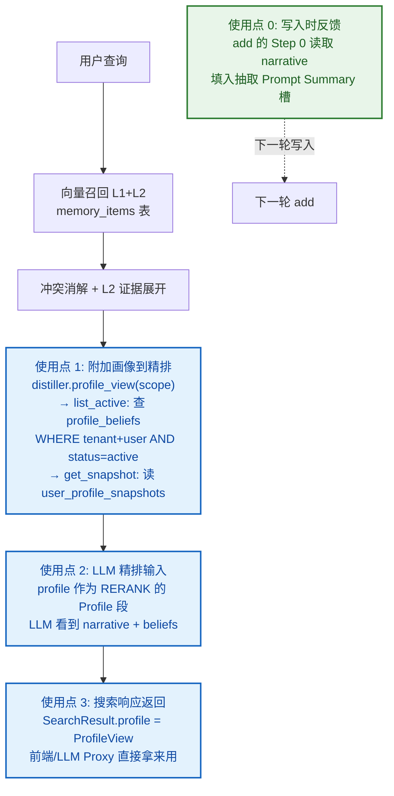

**使用点 0（写入时反馈）：** `add` 的 Step 0 读取 `user_profile_snapshots.narrative`（`memory.py:407`），填入 LLM 抽取 Prompt 的 Summary 槽。这让抽取 LLM 知道"用户空调现在是 26 度"，避免重复抽取已知偏好。

**使用点 1（精排前附加）：** `search_result`（`memory.py:810-815`）调用 `distiller.profile_view(scope)`，内部执行 `list_active`（`profile.py:182-223`）：

```sql
-- profile.py:200-206：主键直读，不走向量
SELECT id, attribute, value, conditions, stability, status, ...
FROM profile_beliefs
WHERE tenant_id = %s AND user_id = %s AND occupant_id = %s
  AND status = 'active'
ORDER BY updated_at DESC
```

同时读 `user_profile_snapshots` 拿到 narrative 文本。结果组装成 `ProfileView`。

**使用点 2（精排输入）：** `reranker.py:51-56` 把 `ProfileView` 序列化为 JSON，拼进精排 LLM 的 user prompt：

```json
"## Profile\n{\"narrative\": \"User 空调温度: 26度\\nUser 音乐偏好: 爵士乐\", \"beliefs\": [...]}"
```

精排 LLM 看到 profile 后，对于"用户平时空调多少度"这类查询，可以直接从画像里找到答案，不依赖向量是否命中。

**使用点 3（搜索响应）：** `search_result` 返回 `SearchResult(memories=..., profile=profile)`（`memory.py:824-829`），profile 始终在响应里：

```json
{
  "memories": [...],
  "query": "用户平时空调多少度",
  "top_k": 5,
  "profile": {
    "narrative": "User 空调温度: 26度\nUser 音乐偏好: 爵士乐",
    "beliefs": [
      {"attribute": "空调温度", "value": "26度", "status": "active", "stability": "episode"},
      {"attribute": "音乐偏好", "value": "爵士乐", "status": "active", "stability": "recurring"}
    ]
  }
}
```

**举例：不同查询下 L3 的不同作用**

| 查询 | L1/L2 向量召回 | L3 画像的作用 |
|------|---------------|--------------|
| "用户平时空调多少度" | 可能命中 l1-f "改为 26 度" | profile.narrative 直接写"空调温度: 26度"，精排 LLM 优先选这个 |
| "老规矩开空调" | "老规矩"语义模糊，L1 可能命中率低 | L3 有 stability=recurring 的信念 → 精排 LLM 知道当前习惯是 26 度 |
| "帮我开到老样子" | 向量几乎无法匹配"老样子" | profile 每轮必带，不依赖向量命中 → LLM Proxy 直接从 profile 回答 |
| "我空调一般开几度" | l1-a(22度) 被 supersede 过滤，l1-f(26度) 可能排第一 | profile 确认 26 度 active，不会返回 22 度 |

**一句话总结：** L3 是"这个人现在是什么样"的结构化答案。它不参与向量召回，而是每轮搜索时按主键直读、始终附带在响应里——模糊查询（"老样子""老规矩"）靠 L3 兜底，偏好更新靠 status=active/superseded 保证返回最新值，习惯判断靠 stability=recurring 区分长期和临时。

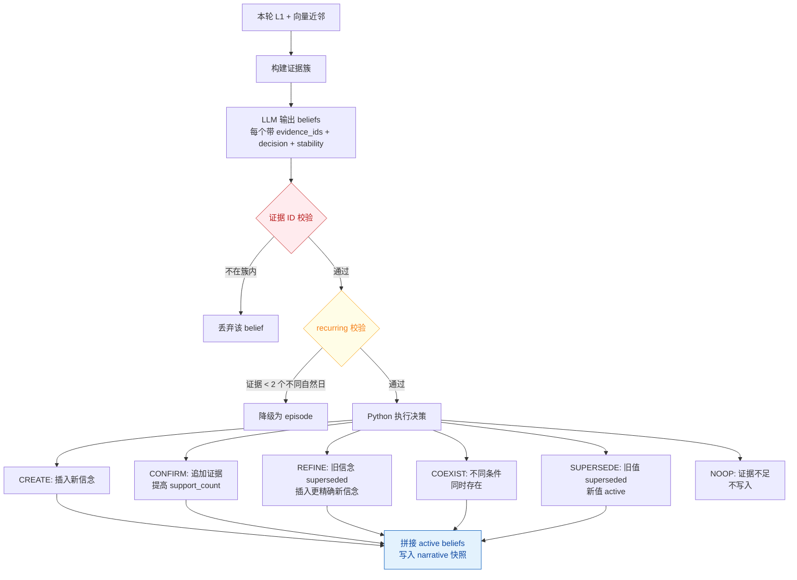

**防幻觉不变量：**

| 不变量 | 实现方式 |
|--------|----------|
| 证据 ID 必须来自真实候选 | `evidence = [eid for eid in evidence_ids if eid in valid_ids]` |
| recurring 需 ≥2 个不同自然日 | `distinct_days = {evidence_days.get(item) for item in evidence} - {None}` |
| LLM 不直接写库 | 全部通过 `self.store.insert/update` 执行 |
| 降级 ≠ 丢弃 | recurring 不足 2 天 → 改为 episode 但仍写入；NOOP 才不写入 |

#### 当前实现：全量传入精排，无筛选

代码链路确认（`distiller.py:144` + `reranker.py:51` + `models.py:113-114`）：

1. `list_active` 只按 `tenant_id + user_id + status='active'` 过滤，不按查询内容筛选
2. `profile.to_public_dict()` 序列化整个 `ProfileView`，包含 narrative + 全部 beliefs
3. 每个 `BeliefItem.to_public_dict()` 直接 `model_dump()`，输出全部 12 个字段

一个 belief 序列化后约 200 字符：

```json
{"id":"b-002","subject":"User","attribute":"空调温度","value":"26度","conditions":{},
"stability":"episode","status":"active","confidence":0.9,"support_count":1,
"occupant_id":"primary","evidence_memory_ids":["l1-f"],"evidence_episode_ids":[]}
```

narrative 是 active beliefs 拼接文本，和 beliefs 列表信息重复。

| active beliefs 数量 | profile 段 token（粗估） | 是否可控 |
|---|---|---|
| 5 条 | ~400 tokens | 完全可控 |
| 15 条 | ~1200 tokens | 可控 |
| 30 条 | ~2400 tokens | 开始影响成本 |
| 50 条 | ~4000 tokens | 需要优化 |

车载场景偏好有限（空调、导航、音乐、座椅等），实际 active beliefs 通常在 5~15 条量级，当前全量传入可以接受。但设计上没有截断或筛选机制，长期积累或维度扩展后会有 token 浪费。

#### 后续优化方向

| 优化方向 | 做法 | 效果 | 代价 |
|----------|------|------|------|
| **1. 精简字段** | `to_public_dict()` 只输出 attribute/value/conditions/stability，去掉 id/subject/occupant_id/evidence_memory_ids/evidence_episode_ids/confidence/support_count | 每条 200→~60 字符，token 降 70% | 精排 LLM 看不到证据溯源信息（但这些信息对精排排序无用） |
| **2. 去掉 narrative** | 只传 beliefs 列表，不传 narrative（narrative 是 beliefs 的文本拼接，信息重复） | 省 ~100 tokens | 无（narrative 本来就是冗余的） |
| **3. 按 query 向量筛选** | 用 query embedding 对 `attribute_embedding` 做 top-k 相似搜索，只传相关 beliefs | 从全量 50 条筛到 5 条 | 车载偏好少时收益不大；需要额外一次 ANN 查询 |
| **4. 分层传入** | stability=identity/recurring 全量传入，stability=episode 只传和 query 相关的 | 高稳定信念始终在场，临时信念按需 | 实现复杂度高，收益取决于 episode 占比 |
| **5. 硬上限截断** | `list_active` 结果按 `updated_at DESC` 截断 top-20 | 防止极端情况 token 爆炸 | 可能丢失旧但稳定的偏好（需配合 stability 优先排序） |

**推荐的渐进式优化路径：**

```
当前状态: 全量传入，车载场景 5~15 条，可控
    │
    ├─ 第一步（低成本高收益）: 精简字段 + 去掉 narrative
    │   → 每条 200→60 字符，整体 token 降 ~70%
    │   → 改动仅涉及 to_public_dict()，一行代码
    │
    ├─ 第二步（防御性）: 硬上限截断 top-20
    │   → 防止长期积累或维度扩展后 token 爆炸
    │   → 改动仅涉及 list_active 加 LIMIT
    │
    └─ 第三步（按需触发）: 当 active beliefs > 20 时自动启用 query 向量筛选
        → 用 query embedding 搜 profile_beliefs.attribute_embedding
        → 只传 top-k 相关 beliefs
        → 需要在 reranker 前加一步 ANN 查询
```

第一步和第二步改动最小、风险最低，建议优先实施。第三步在 beliefs 数量增长到 20+ 时才有必要。

---

## 三点五、L1/L2/L3 记忆演化与可观测性

### 3.5.1 演化总览

三层记忆不是静态存储，而是随每次对话动态演化。每次 `POST /v1/memories` 写入新对话后，系统自动执行派生和审计：

```mermaid
flowchart TD
    INPUT["对话写入 POST /v1/memories"] --> L1["L1 ADD<br/>抽取原子事实<br/>不可变追加"]
    L1 --> L2_EVT{"有 active episode?"}
    L2_EVT -->|continues=true| L2_UPD["L2 UPDATE<br/>续写 episode 摘要<br/>合并 source_memory_ids"]
    L2_EVT -->|continues=false| L2_CLOSE["L2 COMPLETE 旧 episode<br/>L2 ADD 新 episode"]
    L2_UPD --> L3
    L2_CLOSE --> L3

    L3["L3 蒸馏"] --> L3_JUDGE{"LLM 判断 belief 决策"}
    L3_JUDGE -->|新属性| L3_CREATE["L3 ADD (CREATE)<br/>插入新信念"]
    L3_JUDGE -->|同属性同值| L3_CONFIRM["L3 CONFIRM<br/>support_count+1"]
    L3_JUDGE -->|同属性不同值| L3_SUP["L3 SUPERSEDE<br/>旧信念 superseded<br/>新信念 active"]
    L3_JUDGE -->|不同条件| L3_COEX["L3 COEXIST<br/>条件不同的信念并存"]

    L1 -.->|审计| AUDIT["memory_audit_events"]
    L2_UPD -.->|审计| AUDIT
    L2_CLOSE -.->|审计| AUDIT
    L3_CREATE -.->|审计| AUDIT
    L3_CONFIRM -.->|审计| AUDIT
    L3_SUP -.->|审计| AUDIT
    L3_COEX -.->|审计| AUDIT

    style L1 fill:#e8f5e9,stroke:#2e7d32,stroke-width:2px
    style L2_UPD fill:#fffde7,stroke:#f9a825
    style L2_CLOSE fill:#fffde7,stroke:#f9a825
    style L3_CREATE fill:#e3f2fd,stroke:#1565c0
    style L3_SUP fill:#e3f2fd,stroke:#1565c0
    style AUDIT fill:#f3e5f5,stroke:#7b1fa2
```

### 3.5.2 演化事件类型与触发条件

| 事件 | 层级 | 触发条件 | 代码位置 |
|------|------|----------|----------|
| **ADD** | L1 | 对话中抽取出新的原子事实 | `memory.py:_persist_texts` |
| **ADD** | L2 | 无 active episode 或 continues=false，创建新 episode | `memory.py:_upsert_episode` |
| **UPDATE** | L2 | continues=true，续写当前 active episode 的摘要和 source_memory_ids | `memory.py:_upsert_episode` |
| **COMPLETE** | L2 | continues=false 时，旧 episode 从 active 变为 complete | `memory.py:_upsert_episode` |
| **ADD (CREATE)** | L3 | 蒸馏出新属性，无匹配的已有 belief | `distiller.py:_apply_one` |
| **CONFIRM** | L3 | 新证据确认已有 belief，attribute_embedding cosine ≥ 0.82 且 value 相同 | `distiller.py:_apply_one` |
| **SUPERSEDE** | L3 | 同属性不同值，旧 belief 标记 superseded，新 belief active | `distiller.py:_apply_one` |
| **COEXIST** | L3 | 同属性但 conditions 不同（如不同季节），两个 belief 并存 | `distiller.py:_apply_one` |
| **DELETE** | L1/L2 | 人工调用 DELETE API 删除单条记忆 | `memory.py:delete` |
| **FORGET** | 预留 | 自动遗忘机制（当前未启用，API 已支持事件类型） | — |

### 3.5.3 审计存储与安全降级

审计事件写入 `memory_audit_events` 表（迁移 006）。审计采用 **safe_append** 模式：

```python
# stores/audit.py — safe_append
async def safe_append(store, event):
    try:
        await store.append_event(event)
    except Exception as e:
        logger.warning(f"审计写入失败: {e}")
        # 不抛异常，不影响已成功的记忆写入
```

**设计原则**：审计是附属能力，不能因为审计失败阻断记忆写入。L1 写入成功后审计失败只记录 warning，不回滚。

`delete_all` 隐私语义：彻底清除用户所有数据，**包括审计事件**。不为调试保留用户已要求删除的内容。单条 DELETE 保留安全审计摘要（不含 embedding）。

### 3.5.4 观测接口

**GET /v1/users/{user_id}/memory-layers**

统一查询 L1/L2/L3 全量数据：

| 参数 | 默认值 | 说明 |
|------|--------|------|
| tenant_id | default | 租户隔离 |
| occupant_id | 可选 | 乘员位置过滤，不传则查全部 |
| include_inactive | true | 是否包含 superseded L3 信念 |
| l1_limit/l2_limit/l3_limit | 100 (max 500) | 各层返回上限 |

返回结构：

```json
{
  "stats": {
    "l1_count": 3, "l2_count": 1,
    "l2_active_count": 1, "l2_complete_count": 0,
    "l3_count": 2, "l3_active_count": 2, "l3_superseded_count": 0
  },
  "l1": [ { "id": "...", "content": "...", "source": "conversation", ... } ],
  "l2": [ { "id": "...", "content": "...", "metadata": { "episode_status": "active" }, ... } ],
  "l3": [ { "attribute": "...", "value": "...", "status": "active", ... } ]
}
```

不返回 embedding / attribute_embedding。列表按 updated_at 倒序。

**GET /v1/users/{user_id}/memory-events**

查询审计事件（演化记录），支持按层级和事件类型过滤、游标分页（created_at + id 稳定排序）。

### 3.5.5 前端观测面板

前端 cockpit-frontend 右侧"记忆观测"面板实时展示三层记忆状态：

| 标签页 | 数据来源 | 展示内容 |
|--------|----------|----------|
| 总览 | memory-layers stats | L1/L2/L3 计数、L2 active/complete、L3 active/superseded、今日演化事件数 |
| L1 事实 | memory-layers l1[] | content、source、scene、occupant_id、metadata、删除按钮 |
| L2 情景 | memory-layers l2[] | 摘要、episode_status、occurred_at、confidence、来源 L1 链接 |
| L3 画像 | memory-layers l3[] | attribute、value、conditions、stability、status、confidence、evidence |
| 演化记录 | memory-events | 倒序审计事件，ADD(绿)/UPDATE(蓝)/SUPERSEDE(橙)/DELETE(红)，支持过滤 |

数据刷新时机：登录时加载、对话写入后自动刷新、删除后自动刷新。观测失败不阻断对话。

> 前后端完整交互文档见 [cockpit-frontend/docs/frontend-backend-interaction.md](https://github.com/psile/cockpit-frontend/blob/main/docs/frontend-backend-interaction.md)

---

## 四、检索链路

### 4.1 十阶段混合检索全流程

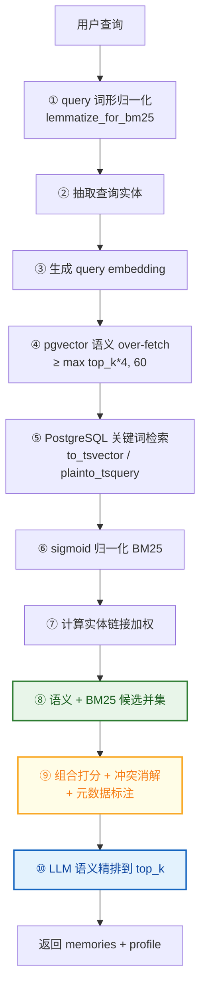

### 4.2 组合打分公式

```text
combined = (semantic + bm25 + entity_boost + temporal_bonus) / max_possible
```

| 分量 | 最大权重 | 说明 |
|------|----------|------|
| semantic | 1.0 | cosine 相似度（`1.0 - distance`） |
| bm25 | 1.0 | sigmoid 归一化后的 BM25 |
| entity_boost | 0.5 | 实体链接加权 |
| temporal_bonus | 0.15 | 30 天半衰期指数衰减 |

**时间衰减公式（2026-09-04 修复）：**

```python
# 修复前: exp(-days/30)        → 30天时保留 36.8%（不是半衰期）
# 修复后: exp(-ln2 * days/30)  → 30天时保留 50%（真正的半衰期）
return weight * math.exp(-math.log(2.0) * delta_days / half_life_days)
```

### 4.3 候选并集（2026-09-04 修复）

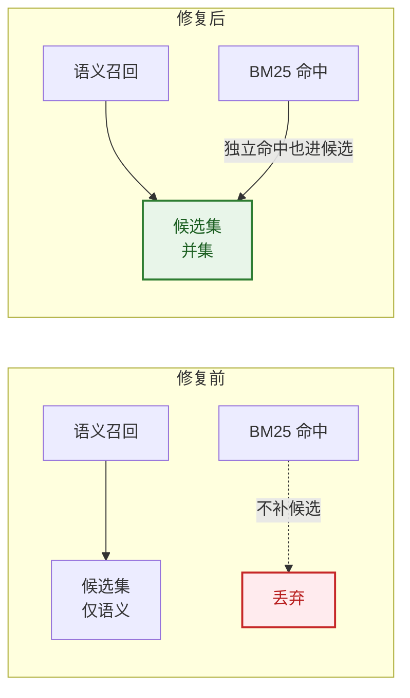

### 4.4 冲突消解流程

#### 什么时候用

L1 是 ADD-only 不可变的——用户每次说"空调调到 22 度"或"从现在开始改成 26 度"，都会新增一条 L1，不会修改旧记录。这意味着同一个人的同一个偏好可能有多条 L1 共存：

```
l1-a (09-04): "用户喜欢空调 22 度"         ← 旧值
l1-f (09-10): "用户将空调改为 26 度"         ← 新值，含显式更新表达"改为"
```

向量召回时两条都可能命中（都和"空调多少度"语义相关）。如果不做冲突消解，返回结果里会同时出现 22 度和 26 度——前端不知道该信哪个。

**冲突消解就是在这个环节介入：在组合打分完成后、截断到 top_k 之前，过滤掉被 SUPERSEDE 的旧值，让下游只看到最新值。**

#### 在十阶段中的位置

```
⑧ 语义+BM25 候选并集 → ⑨ 组合打分 → 冲突消解（9b）→ 元数据标注（9c）→ 截断 top_k（9d）→ ⑩ 精排
                                            ↑
                                    在截断前执行，过滤旧值后由后续候选补位
```

代码位置：`retriever.py:143-149`——`resolve_conflicts(out)` 先执行，`out[:top_k]` 截断在后。2026-09-04 修复时把这个顺序从"截断后"前移到"截断前"，确保过滤掉的旧值有空位让后续候选补进来。

#### 工作原理（结合案例）

**案例数据：** 用户跨 6 天说了 5 句话，向量召回后 4 条命中

```
候选列表（组合打分后排序）：
┌──────┬────────┬──────────────────────────────┬─────────┬────────┐
│ 排名 │ ID     │ content                      │ is_update│ value  │
├──────┼────────┼──────────────────────────────┼─────────┼────────┤
│  1   │ l1-f   │ "用户将空调改为 26 度"          │ True    │ 26度   │  ← 09-10
│  2   │ l1-a   │ "用户喜欢空调 22 度"           │ False   │ 22度   │  ← 09-04
│  3   │ l1-c   │ "空调温度设为 22 度"            │ False   │ 22度   │  ← 09-04
│  4   │ l1-b   │ "用户喜欢听爵士乐"             │ False   │ None   │  ← 09-04
└──────┴────────┴──────────────────────────────┴─────────┴────────┘
```

**逐步执行过程：**

```
① 检测显式更新表达（detect_update_expression, conflict_resolution.py:88-90）
   扫描每条 content 是否匹配 _UPDATE_PATTERNS（13 个正则，line 45-59）：
   ┌────────┬──────────────────────────┬───────────┐
   │ ID     │ content 片段              │ 匹配结果   │
   ├────────┼──────────────────────────┼───────────┤
   │ l1-f   │ "改为26度"               │ ✓ 改为     │
   │ l1-a   │ "喜欢22度"               │ ✗ 无匹配   │
   │ l1-c   │ "设为22度"               │ ✗ 无匹配   │
   │ l1-b   │ "喜欢爵士乐"             │ ✗ 无匹配   │
   └────────┴──────────────────────────┴───────────┘

② 提取 memory_key（extract_memory_key, line 93-103）
   用 _COCKPIT_PATTERNS 匹配车机实体（line 68-79）：
   l1-f → "空调" 匹配 → memory_key = "空调温度"
   l1-a → "空调" 匹配 → memory_key = "空调温度"
   l1-c → "空调" 匹配 → memory_key = "空调温度"
   l1-b → "音乐" 匹配 → memory_key = "音乐偏好"

③ 提取 value（extract_value, line 106-115）
   用 _VALUE_PATTERNS 匹配数值+单位或引号内容（line 62-65）：
   l1-f → "26度"
   l1-a → "22度"
   l1-c → "22度"
   l1-b → None（无可提取值）

④ 按 user_id + memory_key 分组（line 219-224）
   组 "空调温度"：[l1-f, l1-a, l1-c]  ← 3 条同 key
   组 "音乐偏好"：[l1-b]              ← 1 条，不触发消解

⑤ 时序排序：按 effective_at → updated_at → created_at 降序（line 183-185, 230-231）
   _sort_key(meta) = meta.effective_at or meta.updated_at or meta.created_at
   group.sort(key=_sort_key, reverse=True)  # 最新的排最前

   "空调温度"组排序后：
   ┌──────┬────────┬─────────────────────┬─────────────────────┐
   │ 顺序 │ ID     │ effective_at         │ 来源                 │
   ├──────┼────────┼─────────────────────┼─────────────────────┤
   │  1   │ l1-f   │ 2026-09-10T14:30     │ created_at（最新）   │
   │  2   │ l1-a   │ 2026-09-04T10:00     │ created_at          │
   │  3   │ l1-c   │ 2026-09-04T10:20     │ created_at          │
   └──────┴────────┴─────────────────────┴─────────────────────┘
   ↑ l1-f 排第一 → 它是 newest_update，有资格 SUPERSEDE 其余

   【时序的作用】冲突消解不只是"有更新表达就过滤"，还要确认
   "谁更新谁"。effective_at 是记忆的生效时间（从 created_at 推导，
   line 118-124），排序后最新的那条才是"当前值"。
   如果不排序，l1-a (09-04) 可能被误判为最新，用它去 SUPERSEDE
   l1-f (09-10)，导致返回旧值 22 度而非新值 26 度。

⑥ 组内判断：有 is_update=True 且值不同？（line 234-264）
   "空调温度"组：l1-f 排在第一位，is_update=True，value=26度
   ┌────────┬────────┬────────┬──────────────┐
   │ 对比   │ l1-a   │ l1-c   │ 判定         │
   ├────────┼────────┼────────┼──────────────┤
   │ value  │ 22度   │ 22度   │              │
   │ ≠ l1-f │ 不同   │ 不同   │ → SUPERSEDES │
   └────────┴────────┴────────┴──────────────┘
   l1-a 和 l1-c 被标记为 filtered_ids（从结果中移除）
   l1-f 标记为 is_current=True，supersedes=[l1-a, l1-c]

   "音乐偏好"组：只有 1 条，len < 2 → 跳过（line 227-228）
```

**消解后结果：**

```
filtered_ids: {l1-a, l1-c}     ← 被过滤，不返回给下游
kept_ids:     {l1-f, l1-b}     ← 保留

返回给精排的候选：
┌──────┬────────┬──────────────────────────────┬────────────────────────────────┐
│ 排名 │ ID     │ content                      │ 元数据标注                      │
├──────┼────────┼──────────────────────────────┼────────────────────────────────┤
│  1   │ l1-f   │ "用户将空调改为 26 度"          │ memory_key: 空调温度            │
│      │        │                              │ is_current: true               │
│      │        │                              │ relation_type: SUPERSEDES       │
│      │        │                              │ supersedes: [l1-a, l1-c]        │
│  2   │ l1-b   │ "用户喜欢听爵士乐"             │ memory_key: 音乐偏好            │
│      │        │                              │ is_current: true               │
└──────┴────────┴──────────────────────────────┴────────────────────────────────┘
```

#### 什么情况不触发消解

| 场景 | 示例 | 判定 | 结果 |
|------|------|------|------|
| 无显式更新表达 | "我喜欢 22 度" vs "空调设 22 度" | 两条都 `is_update=False` | 标记 RELATED_TO，都保留 |
| 同值不冲突 | "改为 26 度" vs "设成 26 度" | 有更新但 value 相同 | 标记 RELATED_TO，都保留 |
| 不同 memory_key | "空调 26 度" vs "座椅加热 3 档" | 分属不同组 | 各自独立，不过滤 |
| 组内仅 1 条 | 只有 l1-b "爵士乐" | `len(group) < 2` | 跳过 |
| 无可提取 value | "改为自动模式" vs "设为手动" | `value = None` | 不判定 SUPERSEDE |

**关键设计：保守策略。** 只有"显式更新表达 + 同 memory_key + 值不同"三个条件同时满足才过滤。模糊话题重叠不是冲突，只是 RELATED_TO 链接。

#### 作用总结

| 没有冲突消解 | 有冲突消解 |
|------------|-----------|
| 返回 22 度和 26 度，前端不知道用哪个 | 只返回 26 度（最新值） |
| 旧 L1 占据 top_k 名额，挤掉其他相关结果 | 旧 L1 被过滤，后续候选补位 |
| 精排 LLM 看到矛盾信息，可能选错 | 精排 LLM 只看到当前值 |
| 无法追溯偏好变更历史 | 旧值仍在库中（ADD-only），只是不返回 |
| 前端无法区分"当前值"和"历史值" | `is_current` + `supersedes` 元数据标注 |

**一句话总结：** 冲突消解靠"显式更新表达检测 + memory_key 分组 + 时序排序"三步定位"谁更新了谁"，在截断 top_k 前过滤掉被 supersede 的旧值、让后续候选补位——保证下游只看到最新偏好，旧值仍在库中但不返回。

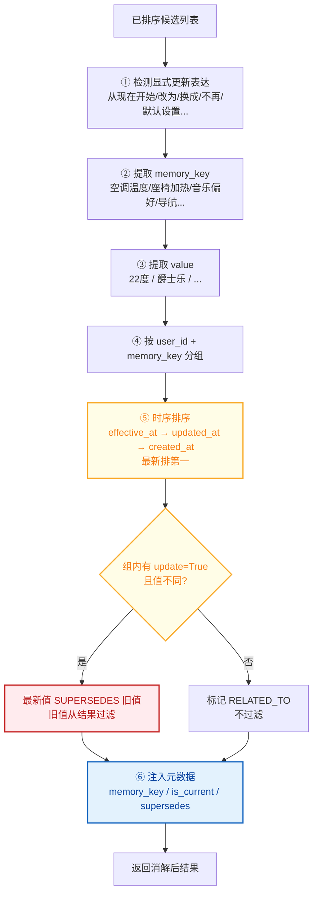

**2026-09-04 修复：** 冲突消解从"截断后"前移到"截断前"执行，过滤旧值后由后续候选补位。

**局限性：** 当前 `memory_key` 和 value 提取覆盖空调、座椅、音乐、导航、音量、后视镜、车窗等中文车机表达。音乐风格、路线策略、自然语言否定、英文表达等容易漏判。应优先以 L3 结构化信念作为偏好真相，规则模块保留为 fallback。

### 4.5 实体链接

#### 原理与作用

实体链接是写入和检索之间的桥梁。语义检索靠 cosine 相似度，但中文车机场景里同一个实体可能用不同表述——"导航去公司""开车到单位""去上班的地方"都指向同一个目的地实体。向量相似度不一定能把它们关联起来。

实体链接的作用：**在写入时把 L1 中的实体提取出来存到独立的 `memory_entities` 表，建立实体↔记忆双向链接；在检索时从 query 抽取实体，匹配实体库，给关联的 L1 加权。**

```
没有实体链接                          有实体链接
─────────────                       ─────────────
query: "导航去公司"                   query: "导航去公司"
  → 向量召回靠 cosine                   → 抽取实体 "公司"
  → "开车到单位" cosine 可能不高          → 实体库匹配 "公司" ≈ "单位" (0.95)
  → 可能漏召回                          → 给 "开车到单位" 加 entity_boost
                                       → 从漏召回 → 命中
```

#### 写入时：建立实体↔记忆链接

在 add 七步流水线的 Step 6 执行（`memory.py:430`），调用 `linker.link_memories(stored, scope)`（`entity_linker.py:40-73`）：

```mermaid
flowchart TD
    L1["新写入的 L1 记忆<br/>e.g. '用户导航去公司'"] --> EXTRACT[抽取实体<br/>extract_entities_batch]
    EXTRACT --> NORM[归一化<br/>normalize_entity_text → '公司']
    NORM --> EMBED[生成实体 embedding]
    EMBED --> LOOKUP{查实体库}
    LOOKUP -->|精确匹配 normalized| UPDATE[更新 linked_memory_ids<br/>追加新 L1 id]
    LOOKUP -->|cosine ≥ 0.95| UPDATE
    LOOKUP -->|无匹配| CREATE[插入新实体<br/>linked_memory_ids = [新 L1 id]]

    style EXTRACT fill:#e3f2fd,stroke:#1565c0,color:#0d47a1
    style LOOKUP fill:#fffde7,stroke:#f9a825,color:#f57f17
    style UPDATE fill:#e8f5e9,stroke:#2e7d32,color:#1b5e20
    style CREATE fill:#e8f5e9,stroke:#2e7d32,color:#1b5e20
```

**实体抽取规则**（`entities.py:17-21`）：

| 实体类型 | 匹配方式 | 车机场景示例 |
|----------|----------|------------|
| PROPER | 英文大写首字母 / 缩写 | "NIO"、"Tesla" |
| QUOTED | 引号内容 | "帮我设成'舒适模式'" |
| TOPIC | 上下文提示词后的中文 | "导航到公司" → "公司" |
| IDENTIFIER | 技术标识符 | "ISO 27001" |

**过滤通用词**（`entities.py:23-56`）：`_GENERIC_CJK` 集合包含"空调""温度""导航""音乐""座椅"等——这些是属性词不是实体，不建链接。

**举例：** 用户说了三句话，实体库的实际数据

```
写入 l1-a "用户导航去公司"     → 抽取实体 "公司" → 实体库插入 e-1: {text:"公司", linked:[l1-a]}
写入 l1-b "开车到单位"         → 抽取实体 "单位" → cosine("单位","公司")=0.96 ≥ 0.95 → 合并到 e-1: {text:"公司", linked:[l1-a, l1-b]}
写入 l1-c "空调调到 26 度"     → "空调"在 _GENERIC_CJK 中被过滤 → 不建实体链接
```

#### 检索时：实体加权 boost

在检索十阶段的 Step 7 执行（`retriever.py:99-102`），调用 `linker.boosts_for_query(query, scope)`（`entity_linker.py:98-137`）：

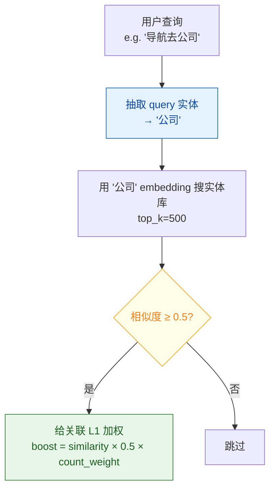

**加权公式**（`entity_linker.py:128-134`）：

```python
# ENTITY_BOOST_WEIGHT = 0.5 (scoring.py)
memory_count_weight = 1.0 / (1.0 + 0.001 * ((num_linked - 1) ** 2))  # 链接越多，单条权重越低
boost = similarity * ENTITY_BOOST_WEIGHT * memory_count_weight
# 取一个实体关联的多条 L1 中的最大 boost
boosts[memory_id] = max(boosts.get(memory_id, 0.0), boost)
```

`memory_count_weight` 是惩罚项：如果一个实体关联了 1000 条 L1（如"公司"出现在很多记忆里），每条 L1 的 boost 会被稀释，避免高频实体过度加权。

**举例：检索时的 boost 计算**

```
query: "导航去公司"
  → 抽取实体 "公司"
  → 搜实体库: e-1 {text:"公司", linked:[l1-a, l1-b]} similarity=1.0
  → num_linked=2, memory_count_weight = 1/(1+0.001×1) = 0.999
  → boost = 1.0 × 0.5 × 0.999 = 0.4995
  → boosts = {l1-a: 0.4995, l1-b: 0.4995}

组合打分时：
  l1-a: semantic(0.82) + bm25(0.30) + entity_boost(0.4995) + temporal(0.15) = 1.77
  l1-b: semantic(0.65) + bm25(0.00) + entity_boost(0.4995) + temporal(0.12) = 1.27
                       ↑ 向量相似度不高                    ↑ 但实体链接拉上来了
```

没有 entity_boost，l1-b "开车到单位"可能因为 cosine 不够高被排在 top_k 之外，被截断丢弃。有了 entity_boost，它被拉进候选池。

#### 数据库存储格式

`memory_entities` 和 `memory_entity_links` 两张表：

```
memory_entities                         memory_entity_links
┌──────────────────────────────┐       ┌──────────────────────────────┐
│ id: e-001                    │       │ memory_id: l1-a              │
│ entity_text: "公司"          │←──────│ entity_id: e-001             │
│ entity_type: TOPIC           │       │                              │
│ normalized_text: "公司"      │       │ memory_id: l1-b              │
│ embedding: [0.23, ...]       │←──────│ entity_id: e-001             │
│ tenant_id: "default"         │       │                              │
│ user_id: "user_001"          │       │ memory_id: l1-e              │
│ linked_memory_ids: [l1-a,   │←──────│ entity_id: e-001             │
│   l1-b, l1-e]                │       │                              │
└──────────────────────────────┘       └──────────────────────────────┘
```

`linked_memory_ids` 是 JSONB 数组，冗余存储在实体行上（`entity_linker.py:166`），避免每次查链接表。`memory_entity_links` 是多对多关联表，同一 L1 可以链接多个实体，同一实体可以关联多条 L1。

#### 在检索链路中的位置

```
① query 词形归一化
② 抽取查询实体 ← extract_entities(query)，结果传给 Step 7
③ 生成 query embedding
④ pgvector 语义 over-fetch
⑤ PostgreSQL 关键词检索
⑥ sigmoid 归一化 BM25
⑦ 计算实体链接加权 ← boosts_for_query(query, scope)
⑧ 语义 + BM25 候选并集
⑨ 组合打分（含 entity_boost）+ 冲突消解 + 元数据标注
⑩ LLM 语义精排
```

Step 2 抽取的查询实体和 Step 7 的实体加权是配合使用的：Step 2 只是抽取（`retriever.py:63`），Step 7 才真正查实体库计算 boost（`retriever.py:101-102`）。entity_boost 在 Step 9 的组合打分公式中作为独立分量（最大权重 0.5），和 semantic、bm25、temporal 一起决定最终排序。

### 4.6 LLM 语义精排

#### 原理与作用

前面九个阶段都是规则驱动：向量 cosine、BM25 词频、实体匹配、时间衰减、冲突消解。这些规则够快但有盲区——"上周那次空调怎么回事"里"上周"是什么时间范围？"那次"指的是哪次经历？"怎么回事"是问温度还是问故障？规则无法回答。

精排的作用：**把规则筛选后的候选池交给 LLM，让它读语义、读时间、读画像，做最终的"哪几条真的能回答用户问题"的判断。**

```
规则阶段（①~⑨）                    LLM 精排（⑩）
──────────────                    ──────────────
快，毫秒级                          慢，一次 LLM 调用
看数值：cosine、BM25、时间衰减        读语义：理解"上周""那次""老样子"
无法理解查询意图                      能区分"问当前偏好"vs"问历史经历"
候选池可能 30 条                     只选 top_k（默认 5 条）
```

#### 输入输出

**输入**（`reranker.py:23-30`）：

| 参数 | 来源 | 内容 |
|------|------|------|
| `query` | 用户原始查询 | "上周那次空调怎么回事" |
| `candidates` | ⑨ 冲突消解后的候选池 | 最多 `rerank_candidate_limit=32` 条（`config.py:60`） |
| `profile` | L3 ProfileView | narrative + active beliefs |
| `top_k` | API 请求参数 | 默认 5 |

**LLM 实际收到的 prompt**（`reranker.py:51-57`）：

```
## Current date
2026-09-11

## Query
上周那次空调怎么回事

## Profile
{"narrative": "User 空调温度: 26度\nUser 音乐偏好: 爵士乐", "beliefs": [...]}

## Candidates
[
  {"id":"0","layer":"episodic_memory","text":"用户在驾车时调整了空调温度，先设22度后改26度","occurred_at":"2026-09-04T10:00","score":0.82},
  {"id":"1","layer":"semantic_memory","text":"用户将空调改为26度","occurred_at":"2026-09-10T14:30","score":0.75},
  {"id":"2","layer":"semantic_memory","text":"用户喜欢空调22度","occurred_at":"2026-09-04T10:00","score":0.71},
  {"id":"3","layer":"episodic_memory","text":"用户去公园散步","occurred_at":"2026-08-28T15:30","score":0.45},
  ...
]

# Output:
```

注意：候选的 `id` 是 fake id（0,1,2,...），不是真实 UUID。LLM 输出 fake id，Python 再映射回真实 ID（`reranker.py:33-39` mapping → `reranker.py:74-81` remap）。这是防止 LLM 幻觉编造不存在的 ID。

**System Prompt**（`prompts.py:89-111`）关键指令：

```
- Select candidates that actually help answer the query
- Interpret time/frequency/"current vs historical" from semantics — not keyword list
- Prefer current profile beliefs when query asks who the user is or what they usually want
- Prefer episodes when query refers to a particular experience
- Drop superseded or off-topic items
- Return: {"selected_ids": [...], "time_scope": {"from":"...","to":"..."} or null}
- selected_ids must be a subset of the given candidate ids
- If nothing relevant, return {"selected_ids": [], "time_scope": null}
```

**输出**（`reranker.py:70-92`）：

```json
{"selected_ids": ["0", "1"], "time_scope": {"from": "2026-09-04", "to": "2026-09-10"}}
```

Python 执行：
1. `parse_object(raw)` 解析 JSON（`parser.py:16-17`）
2. `remap_ids` 把 fake id → 真实 UUID（`parser.py:20-27`）
3. 按 `selected_ids` 顺序组装结果，去重（`reranker.py:74-81`）
4. 如果 LLM 选的不够 top_k，按向量排序补满（`reranker.py:84-91`）

#### 举例：精排如何做规则做不到的判断

**案例 1：模糊时间查询"上周那次"**

```
当前日期: 2026-09-11
查询: "上周那次空调怎么回事"

候选池（冲突消解后，7 条）：
  id=0  L2  "先设22度后改26度"           occurred_at=09-04  score=0.82
  id=1  L1  "改为26度"                   occurred_at=09-10  score=0.75
  id=2  L1  "空调设22度"                  occurred_at=09-04  score=0.71
  id=3  L2  "去公园散步"                  occurred_at=08-28  score=0.45  ← 不相关
  id=4  L1  "听爵士乐"                   occurred_at=09-04  score=0.40  ← 不相关
  id=5  L2  "上次保养"                    occurred_at=08-15  score=0.38  ← 不相关
  id=6  L1  "导航去公司"                  occurred_at=09-07  score=0.35  ← 不相关

LLM 精排判断：
  ① "上周" = 09-04~09-10（从当前日期 09-11 推算）
  ② "那次" = 指一次经历 → 优先选 L2 episode
  ③ "空调怎么回事" = 问温度变化过程
  ④ id=0 是 L2 摘要"先设22后改26"，覆盖了整个过程 → 选
  ⑤ id=1 是 L1"改为26度"，补充最终结果 → 选
  ⑥ id=2 是旧值"22度"，已被 SUPERSEDE → 不选（虽然向量分高）
  ⑦ id=3~6 和空调无关 → 不选

输出: {"selected_ids": ["0","1"], "time_scope": {"from":"2026-09-04","to":"2026-09-10"}}
```

规则阶段做不到的事：BM25 不知道"上周"是哪几天，cosine 不知道"那次"指哪次经历，时间衰减只会给最近的加分但不会换算"上周"。LLM 同时读当前日期+候选时间戳+查询语义，一步完成。

**案例 2：当前偏好查询"我空调一般开几度"**

```
当前日期: 2026-09-11
查询: "我空调一般开几度"

候选池（冲突消解后，5 条）：
  id=0  L1  "改为26度"             occurred_at=09-10  score=0.85
  id=1  L2  "先设22后改26"          occurred_at=09-04  score=0.78
  id=2  L1  "听爵士乐"             occurred_at=09-04  score=0.42

profile: {narrative: "空调温度: 26度", beliefs: [{attribute:"空调温度", value:"26度", stability:"episode"}]}

LLM 精排判断：
  ① "一般开几度" = 问当前偏好，不是问历史经历
  ② System Prompt 指令: "Prefer current profile beliefs when query asks what they usually want"
  ③ profile.narrative 直接写"空调温度: 26度"
  ④ id=0 "改为26度" 是最新事实，和 profile 一致 → 选
  ⑤ id=1 是 L2 历史经历，不是"一般"的答案 → 可选但不优先
  ⑥ id=2 和空调无关 → 不选

输出: {"selected_ids": ["0"], "time_scope": null}
```

规则阶段做不到的事：向量检索不知道"一般"意味着"当前偏好"而非"历史经历"。LLM 读 profile 后能区分意图。

#### 容错与回退机制

| 场景 | 代码 | 行为 |
|------|------|------|
| 候选池为空 | `reranker.py:31-32` | 直接返回空列表，不调 LLM |
| LLM 调用失败 | `reranker.py:67-69` | 回退向量排序 `candidates[:top_k]` |
| JSON 解析失败 | `reranker.py:70-73` | 检查 `selected_ids` 是否存在且为 list，否则回退 |
| LLM 选了 0 条 | `reranker.py:82-83` | 回退向量排序 |
| LLM 选了但不够 top_k | `reranker.py:84-91` | 按向量排序补满剩余位 |
| LLM 编造不存在的 ID | `reranker.py:77-79` | fake id 映射不到真实 ID → 跳过 |

**2026-09-04 修复：**

| 修复项 | 修复前 | 修复后 |
|--------|--------|--------|
| 空结果回退 | 回退向量排序 | 合法空结果返回空列表 |
| 补满 top_k | 用向量排序补满 | 尊重 LLM 选择，不补满 |
| 格式容错 | 隐式信任 JSON | 检查 `selected_ids` 存在且为 list |

注意：`reranker.py:82-83` 当前实现中，如果 LLM 返回空 `selected_ids` 会回退向量排序——这和 2026-09-04 修复表里"合法空结果返回空列表"存在不一致。修复后 `parse_object` + `remap_ids` 会正确处理空列表，但 `if not ordered` 仍触发回退。这是已知的边界行为。

#### L2 证据展开

候选池里如果命中了 L2 episode，精排前会把 L2 的 `source_memory_ids` 指向的同 scope L1 也拉进来（`memory.py:773` 传入的 candidates 已经包含了 retriever 返回的全部候选）。L2 用于找完整事件，L1 用于提供事实依据。精排 LLM 同时看到两层：

```
候选池里可能同时有：
  L2 "先设22度后改26度"  occurred_at=09-04  ← 事件摘要
  L1 "改为26度"          occurred_at=09-10  ← L2 的 source_memory_ids 拉进来的
  L1 "空调设22度"         occurred_at=09-04  ← L2 的 source_memory_ids 拉进来的

LLM 看到 L2 知道"那次经历了什么"
LLM 看到 L1 知道"具体事实是什么"
→ 一起选，返回给前端时 L2 是概述，L1 是细节
```

#### 一句话总结

精排是唯一能理解查询意图的环节——规则阶段用数值筛候选，精排用语义做最终判断，靠"当前日期+候选时间戳"换算相对时间、"profile 画像"区分当前偏好与历史经历、"L2+L1 同池"兼顾事件概述与事实细节，返回的 `selected_ids` + `time_scope` 直接决定前端展示什么。

### 4.7 模糊指令的分层覆盖

| 指令类型 | 靠哪一层 | 工作原理 |
|----------|----------|----------|
| "上周类似的那次" | 精排 LLM + L2 | 精排将"上周"换算为绝对时间窗口 → 从 L2 候选中选择 → 展开 L1 证据 |
| "经常 / 老规矩" | L3 `recurring` | 只信有 ≥2 天证据的 recurring 信念 |
| "帮我开到老样子" | L3 每轮必带 | 画像始终在搜索响应中，不依赖向量命中 |
| "改成另一种" | L1 保留 + L3 SUPERSEDE | 旧事实不删，L3 新行 active 旧行 superseded |

---

## 五、数据模型

### 5.1 PostgreSQL 主存储

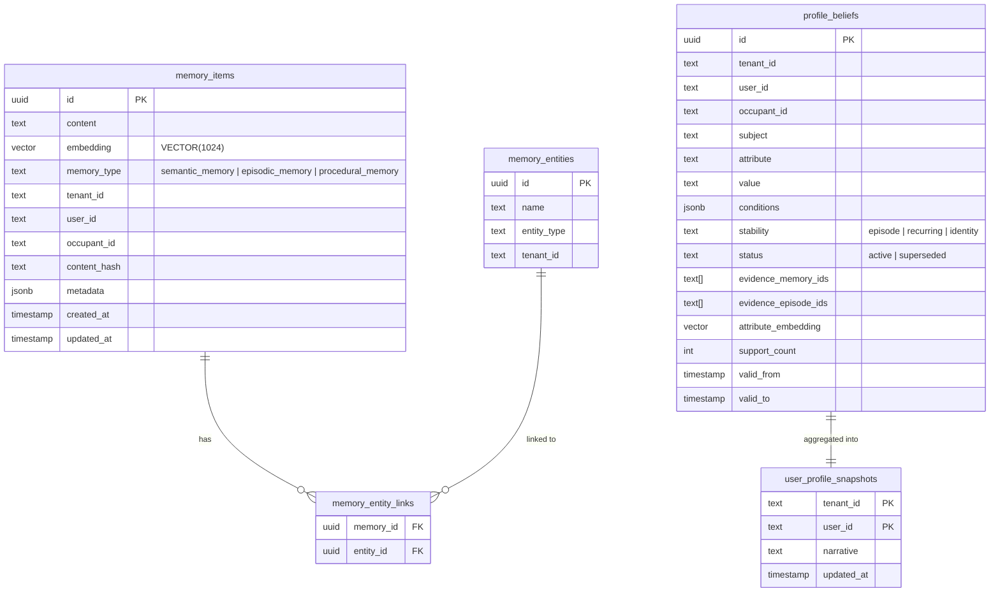

### 5.2 L2 episode metadata 约定

```json
{
  "episode_status": "active",
  "source_memory_ids": ["l1-uuid-1", "l1-uuid-2"],
  "occurred_at": "2026-08-28T15:30:00+08:00",
  "occurred_end": "2026-08-28T16:10:00+08:00",
  "observed_at": "2026-08-28T16:12:00+08:00",
  "confidence": 0.86
}
```

### 5.3 迁移文件

| 迁移 | 内容 |
|------|------|
| `001_initial.sql` | 初始表结构，`VECTOR(1024)` |
| `002_session_entities.sql` | 会话消息表 + 实体表 |
| `003_bm25.sql` | BM25 全文检索支持 |
| `004_layers.sql` | L3 `profile_beliefs` + 画像快照 |
| `005_episode_integrity.sql` | L2 active episode 唯一约束（2026-09-04 新增） |
| `006_memory_observability.sql` | `memory_audit_events` 审计事件表（2026-09-05 新增） |

---

## 六、API 与部署

### 6.1 核心接口

| 方法 | 路径 | 说明 |
|------|------|------|
| `POST` | `/v1/memories` | 写入对话并抽取记忆 |
| `POST` | `/v1/memories/search` | 语义检索（响应含 `profile`） |
| `GET` | `/v1/users/{user_id}/memories` | 列出用户记忆 |
| `GET` | `/v1/users/{user_id}/memories/{memory_id}/history` | 记忆历史（已修复 scope 校验） |
| `DELETE` | `/v1/users/{user_id}/memories/{memory_id}` | 删除单条（校验归属） |
| `DELETE` | `/v1/users/{user_id}/memories?confirm=true` | 清空用户记忆（含审计数据） |
| `GET` | `/v1/users/{user_id}/profile` | 当前画像（支持 `include_superseded`、`occupant_id`、`limit`） |
| `GET` | `/v1/users/{user_id}/memory-layers` | L1/L2/L3 三层统一观测查询 |
| `GET` | `/v1/users/{user_id}/memory-events` | 记忆演化审计事件（游标分页） |

### 6.2 前后端分离部署

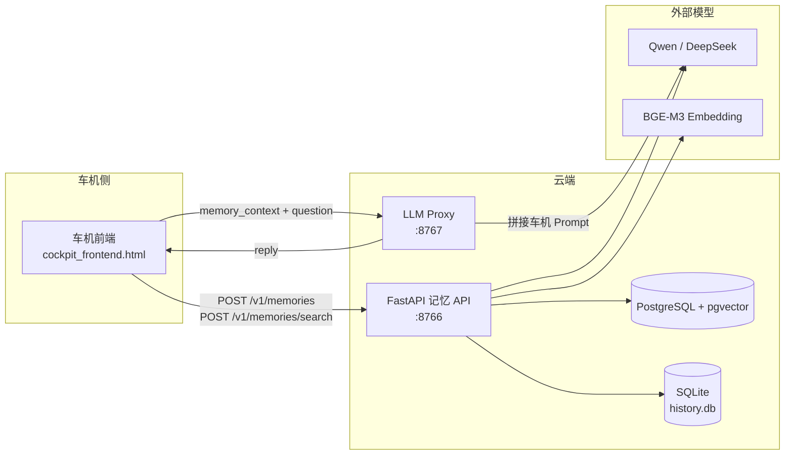

- **记忆 API**：只负责记忆的写入、检索、画像维护、三层观测
- **LLM Proxy**：接收前端 `memory_context`，拼接车机 Prompt 后调用 LLM 生成最终回复，隔离模型密钥
- **部署**：Docker Compose（postgres + api 两容器）或直接 uvicorn 部署，当前服务器 API 在端口 20144

### 6.3 LLM Proxy 安全加固（2026-09-04）

| 修复项 | 修复前 | 修复后 |
|--------|--------|--------|
| CORS | `allow_origins=["*"]` | `LLM_PROXY_ALLOWED_ORIGINS` 白名单 |
| 鉴权 | 无 | `LLM_PROXY_API_KEY` + timing-safe 对比 |
| 错误处理 | `return {"reply": f"(LLM 调用失败: {e})"}` | 502 + 脱敏消息 |

---

## 七、2026-09-04 ~ 09-07 修复清单

| # | 日期 | 修复项 | 优先级 | 涉及文件 |
|---|------|--------|--------|----------|
| 1 | 09-04 | History 接口 scope 校验（越权读取） | P0 | `memories.py`, `memory_service.py`, `memory.py` |
| 2 | 09-04 | LLM Proxy 鉴权 + CORS 白名单 + 错误脱敏 | P0 | `scripts/llm_proxy.py` |
| 3 | 09-04 | 语义 + BM25 候选并集 | P2 | `retriever.py`, `scoring.py` |
| 4 | 09-04 | 冲突消解前移到截断前 | P2 | `retriever.py`, `scoring.py` |
| 5 | 09-04 | 时间公式改为真正 30 天半衰期 | P2 | `scoring.py` |
| 6 | 09-04 | L1 增加 `observed_at`，`occurred_at` 强制绝对 ISO-8601 | P1 | `memory.py` |
| 7 | 09-04 | L2 时间从 L1 证据推导，Prompt 禁止相对时间 | P1 | `memory.py`, `prompts.py` |
| 8 | 09-04 | L2 命中后展开 L1 证据入精排池 | P1 | `memory.py` |
| 9 | 09-04 | L3 recurring 需 ≥2 个不同自然日证据 | P1 | `distiller.py` |
| 10 | 09-04 | L2 active episode 唯一约束 | P1 | `005_episode_integrity.sql` |
| 11 | 09-04 | 精排空结果不回退、不补满 | P2 | `reranker.py` |
| 12 | 09-05 | L1/L2/L3 观测 API + 审计事件表（006 迁移） | P1 | `audit.py`, `memory.py`, `memories.py`, `006_memory_observability.sql` |
| 13 | 09-06 | 迁移解析器修复（注释含分号导致 006 拆分失败） | P1 | `cli.py` 迁移解析逻辑 |
| 14 | 09-07 | occupant_id 硬编码 "primary" 导致 memory-layers/profile 查询为空 | P1 | `memories.py:163,184` |
| 15 | 09-07 | pgvector Vector 对象不可迭代导致 /memory-layers 和 /profile 500 | P0 | `profile.py:47`, `pgvector.py:42` |

---

## 八、待处理事项

### P0 级：上线前必须处理

#### 1. L2/L3 多步写入缺少数据库事务或 advisory lock

- **问题**：L3 画像蒸馏的"查近邻 → 决策 → 更新旧 belief → 写新 belief → 刷新 snapshot"是多步流程，同一用户并发写入可能产生多个 active belief 或丢失 support_count。L2 episode 虽然 `005` 迁移加了部分唯一索引约束数据库层面，但应用层的"查 active → 判断 → 写入"仍非原子操作。
- **影响**：并发写入时数据不一致，画像可能重复或丢失
- **建议**：使用 PostgreSQL 用户级 advisory lock（`pg_advisory_xact_lock`）或显式事务包裹多步写入
- **代码位置**：`distiller.py:153-263`（`_apply_one` 方法）、`memory.py:685-740`（`_try_update_episode`）

---

### P1 级：生产稳定性

#### 2. 派生层失败无重试/补偿任务

- **问题**：L2/L3 生成失败只记录 warning，不会留下待补偿任务。长时间运行后 L1 和 L2/L3 可能逐渐不一致
- **影响**：数据完整性随时间退化，无法自动恢复
- **建议**：记录 layer job 状态表，提供按 L1 幂等重建 episode/profile 的命令
- **涉及**：需新增后台任务调度模块

#### 3. SQLite 限制横向扩容

- **问题**：`history.db` 是文件型 SQLite，Docker Compose 挂载到独立 volume。多 API 副本会产生各自的历史和上下文，行为不一致
- **影响**：无法水平扩展 API 服务
- **建议**：将历史和会话消息迁移到 PostgreSQL，或明确单实例部署约束
- **代码位置**：`stores/sqlite_history.py`

#### 4. 精排成本与延迟

- **问题**：每次搜索默认附加一次 LLM 精排调用；每次标准写入最多包含事实抽取、episode 判断、profile 蒸馏等 3~4 次 LLM 调用
- **影响**：P95 延迟和单轮成本可能不可接受
- **建议**：建立超时控制、调用预算（每轮 max LLM calls）、结果缓存、模型降级策略和端到端 P95 指标监控
- **涉及**：`core/memory.py` 的 `add` 和 `search` 方法

---

### P2 级：准确性与工程质量

#### 5. 冲突消解是领域正则，覆盖面有限

- **问题**：`conflict_resolution.py` 只能识别有限中文车机表达（空调、座椅、音乐、导航、音量、后视镜、车窗）和数值/引号值。音乐风格、路线策略、自然语言否定、英文表达等容易漏判
- **影响**：偏好更新检测不完整，旧值可能仍出现在搜索结果中
- **建议**：优先以 L3 的结构化 `attribute/conditions/status` 作为当前偏好真相，规则模块保留为可解释 fallback；长期应引入 LLM 辅助冲突检测

#### 6. Embedding 维度迁移策略未明确

- **问题**：`001_initial.sql` 和 `004_layers.sql` 都把向量类型固定为 `VECTOR(1024)`。`EMBEDDING_DIMS` 环境变量只改应用配置，不改表结构。`004_layers.sql` 中 `chk_belief_embedding_dims CHECK (TRUE)` 实际没有校验作用
- **影响**：切换 embedding 模型需要手工迁移，容易出错
- **建议**：写专用维度迁移脚本，去掉无效 CHECK 约束，在迁移文档中明确步骤

#### 7. 根目录误提交文件

- **问题**：根目录存在 `3.2.0` 和 `3.2.0.dev1` 文件，内容是 pip 安装日志
- **建议**：从版本库删除并加入 `.gitignore`

#### 8. 文档版本不同步

- **问题**：`PROJECT_OVERVIEW.md` 部分描述仍停留在旧的单层/九阶段基线，而 README 已描述三层新能力
- **建议**：建立单一架构真源文档，在发布检查中验证文档版本一致性

#### 9. L1 缺少显式 `occurred_at`，批量导入历史数据时时间失真

- **问题**：L2 Episode 在 `_upsert_episode`（`memory.py:693-694`）中将 `occurred_at` 写入 metadata，但 L1 Fact 在 `_persist_texts`（`memory.py:544-572`）中只设置 `created_at = now`，不写 `metadata.occurred_at`。精排时 `reranker.py:46-47` 用 `meta.get("occurred_at") or _as_iso(row.created_at)` 回退——L2 拿到真实事件时间，L1 拿到的是入库时间。正常在线使用时两者几乎相同，但**批量导入历史数据时所有 L1 的 created_at 都是导入那一刻的时间**，导致一年前的记忆看起来像"刚刚写入"，冲突消解的时序排序和精排的时间换算全部失效。
- **影响**：年度评测集（yearlong_cockpit_sessions.jsonl 495 条会话跨 365 天）导入后，L1 层完全丢失原始发生时间；fuzzy_05"上周的亲子餐厅"只能靠 L2 或文本中的 `[YYYY-MM-DD HH:MM]` 前缀命中，无法靠结构化字段过滤
- **建议**：
  1. `_persist_texts` 写入时将调用方传入的 `extra.occurred_at`（已在 api_payload.metadata 中存在）透传到 L1 的 `meta["occurred_at"]`
  2. 或在 API 路由层允许显式覆盖 `created_at`（需评估审计合规性）
  3. 检索层对 occurred_at 缺失的 L1 增加从消息文本提取日期的 fallback（当前已有，但是否稳定未测试）
- **代码位置**：`memory.py:544-572`（`_persist_texts`）、`reranker.py:46-47`、`conflict_resolution.py:118-124`（`extract_effective_at`）

---

### 长期演进项

| 事项 | 说明 |
|------|------|
| 按乘员拆分画像 snapshot | 当前 `user_profile_snapshots` 按 user_id 存一份，多乘员场景需按 occupant_id 拆分 |
| LLM Proxy 分布式限流 | 当前只加了单实例 API Key，多实例部署需 Redis 限流或网关级控制 |
| 真实数据集基线 | 需在真实数据上建立 Recall@K、冲突准确率、画像正确率、P95 延迟和单轮成本基线 |
| 明确未覆盖能力 | Knowledge Memory、Skill 蒸馏、主动服务、多模态、图记忆、端云同步——明确未实现 |

---

## 九、总体评价

本次更新完成了从"能存、能搜"到"能描述一次经历、能形成当前画像、能处理部分偏好变化"的关键跨越。

**架构上最有价值的决策：**

1. L1 真源与派生层可重建 — 容错性好，数据可审计
2. LLM 只提建议不写库 — 防幻觉，可控
3. 画像不与海量事实竞争主向量召回 — 避免稳定偏好被稀释

**当前阶段定位：** 功能验证和受控试点，不直接作为生产级多租户服务。完成 P0/P1 项并补齐真实环境回归后，可进入小流量车机试点。在此之前，建议保持单实例、内网访问和可人工审计的部署方式。
