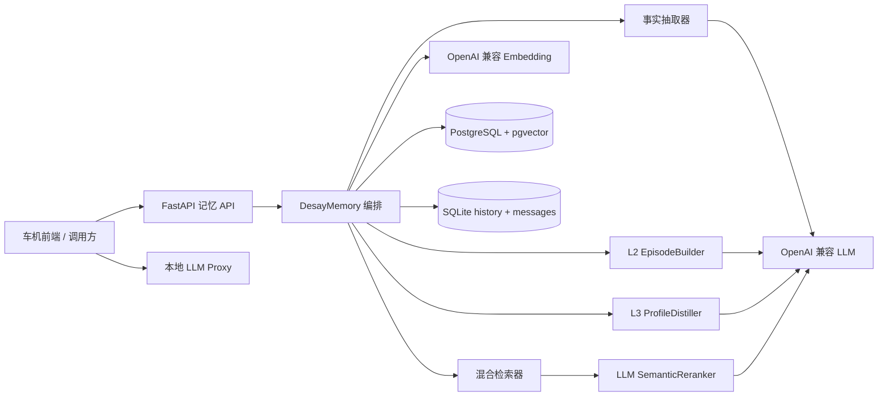

> **[归档文档]** 本文是 2026-09-03 的评审快照，内容已被 [../TECHNICAL_REPORT.md](../TECHNICAL_REPORT.md) 全面覆盖，不再维护。  
> 归档时间: 2026-09-06

# DesayMem_mem0 技术分析与更新评审

> 分析基线：`main` 分支 `ffb62ab`（2026-09-03）  
> 对比区间：`aa5ac2d..ffb62ab`  
> 文档性质：代码级架构说明、更新摘要、风险评审与演进建议

## 1. 结论摘要

本次更新将项目从“单层事实记忆 + 混合检索”的基线，推进为面向车载助手的三层长期记忆系统：L1 保存可追溯的原子事实，L2 聚合一次经历，L3 维护用户当前画像。同时新增时间衰减、冲突消解、LLM 语义精排、浏览器端车机 Demo、本地 LLM 代理、云端部署脚本和长期数据集测试工具。

核心设计方向是合理的：L1 作为真源，L2/L3 都是可重建派生数据；LLM 只提出结构化判断，实际写库由 Python 控制；画像不与海量事实竞争主向量召回。这三点有利于可审计性、容错和长期扩展。

当前版本仍更适合作为功能验证和受控试点，而不是直接作为生产级多租户服务。最优先需要处理的是历史接口的越权读取风险、画像更新并发一致性、固定向量维度迁移，以及独立 LLM 代理的鉴权和错误暴露问题。

## 2. 本次 GitHub 更新范围

仓库由 `aa5ac2d` 快进到 `ffb62ab`，共包含 11 个提交，变更 58 个文件，约新增 8478 行、删除 68 行。主要变化可归纳为五组：

| 方向 | 主要内容 | 关键文件 |
|---|---|---|
| 分层记忆 | L2 事件摘要、L3 用户画像、画像快照 | `layers/*`、`stores/profile.py`、`004_layers.sql` |
| 检索增强 | 时间衰减、规则式冲突消解、LLM 精排 | `retrieval/scoring.py`、`conflict_resolution.py`、`layers/reranker.py` |
| 接口演进 | 搜索返回画像、新增画像查询接口 | `api/routes/memories.py`、`core/result.py` |
| 演示与部署 | 车机网页、LLM 代理、云部署文档与脚本 | `scripts/*.html`、`scripts/llm_proxy.py`、`deploy.sh` |
| 测试数据 | 一年期模糊记忆数据集、HTTP/内存测试脚本、基线报告 | `data_cesi/*`、`scripts/run_yearlong_*` |

提交历史中曾短暂加入后端 `/v1/chat`，随后撤回，最终采用“记忆 API + 本地 LLM 代理 + 浏览器前端”的前后端分离方案。因此当前核心 FastAPI 服务仍只负责记忆，不负责最终对话生成。

## 3. 系统定位与边界

DesayMem_mem0 是从 Mem0 OSS 2.0.18 思路和部分实现迁移、重构出的独立服务，业务命名空间为 `desaymem`，运行时不依赖 `mem0ai`。它面向车机对话的长期记忆写入、召回、画像维护与用户隔离。

当前已实现：

- 语义事实抽取、原文存储和过程性记忆三种写入路径；
- `tenant_id + user_id` 约束下的记忆 CRUD；
- pgvector 语义召回、PostgreSQL 全文检索、实体加权和时间加权；
- L2 事件摘要、L3 当前信念、画像叙事快照；
- 最近会话消息与记忆操作历史；
- FastAPI、Docker Compose、浏览器演示和测试脚本。

明确未覆盖：Knowledge Memory、工具技能蒸馏、主动服务、多模态原始数据、图记忆和端云同步。

## 4. 总体架构



代码依赖方向基本保持为 `api -> services -> core -> providers/stores`。`DesayMemory` 是中心编排器，组装抽取器、检索器、实体链接器、事件构建器、画像蒸馏器和精排器。生产配置使用 PostgreSQL/pgvector 与文件型 SQLite；内存实现主要供测试使用。

### 4.1 三层记忆模型

| 层级 | 语义 | 存储 | 查询方式 | 可重建性 |
|---|---|---|---|---|
| L1 Fact | 自包含原子事实 | `memory_items`，`semantic_memory` | 向量 + BM25 + 实体 + 时间 | 真源 |
| L2 Episode | 一次经历的连续摘要 | `memory_items`，`episodic_memory` | 与 L1 一起向量召回 | 可由 L1 重建 |
| L3 Profile | 当前有效信念/偏好 | `profile_beliefs` | 按用户直接加载 | 可由 L1/L2 重建 |

L2 与 L1 共用 `memory_items`，因为事件摘要需要参与语义召回。L2 保存事件内容和绝对发生时间，不生成或固化“上周”等相对查询概念；查询包含“上周那次”时，由精排 LLM 结合当前日期与候选 `occurred_at` 计算时间窗口。L3 单独存放，避免稳定画像在长期事实向量库中被稀释；其 `attribute_embedding` 仅用于画像蒸馏时判断相似属性，不参与用户查询的主召回。

## 5. 写入链路

### 5.1 标准语义写入

`infer=true` 的主链路如下：

1. 规范化消息并解析对话文本；
2. 读取同一会话最近 `last_k_messages`；
3. 读取 L3 画像快照，填入抽取 Prompt 的 Summary；
4. 用整段对话向量召回已有近邻事实；
5. LLM 单次执行 ADD-only 事实抽取；
6. 按内容 MD5 与数据库已有 hash 去重；
7. 批量生成 embedding，写入 L1 和历史记录；
8. 抽取实体并建立实体—记忆链接；
9. 保存本轮消息；
10. 尝试更新 L2，再尝试蒸馏 L3。

L2/L3 失败只记录 warning，不回滚已成功的 L1。这保证基础事实可用，但也意味着三层在短时间内可能不一致，需要后台重建或补偿任务才能形成生产级最终一致性。

### 5.2 其他写入模式

- `infer=false`：每条非 system 消息直接作为原文记忆写入，不调用事实抽取 LLM。
- `memory_type=procedural_memory`：使用过程记忆 Prompt 生成步骤摘要后入库。
- L1 采用 ADD-only：更新不会物理覆盖旧事实，旧值通过检索期冲突消解或 L3 `superseded` 状态处理。

### 5.3 L2 事件形成

系统读取同一租户、用户、乘员的最新 active episode，把开放事件、新事实、消息、时间及 embedding 相似度交给 LLM 判断：

- `continues=true`：更新原 episode 的摘要、向量和 `source_memory_ids`；
- `continues=false`：将原 episode 标为 complete，再创建 active episode；
- LLM 失败：跳过本轮 L2 更新，不影响 L1。

事件边界由 LLM 判定，没有硬编码时间窗或领域关键词。事件摘要只描述发生的事情，Python 在 metadata 中保存绝对 `occurred_at/occurred_end`；“上周、昨天、前几天”等查询相对时间由搜索精排 LLM 根据当前日期判断。灵活性较高，但其稳定性、成本和可复现性依赖模型版本及 Prompt。

### 5.4 L3 画像蒸馏

画像蒸馏以本轮 L1 和其向量近邻构成证据簇，LLM 给出 belief 与决策，Python 校验证据 ID 并执行 CREATE、CONFIRM、SUPERSEDE 或 COEXIST。系统强制两个关键不变量：证据必须来自真实候选；`recurring` 至少需要两条证据，否则降级为 `episode`。随后将所有 active beliefs 拼成 narrative 快照，供后续事实抽取使用。

## 6. 检索链路

检索采用“宽召回 + 规则打分 + LLM 精排”：

1. query 词形归一化并抽取实体；
2. 生成 query embedding；
3. pgvector 语义 over-fetch，内部至少取 `max(top_k*4, 60)`；
4. PostgreSQL `to_tsvector/plainto_tsquery` 关键词检索；
5. sigmoid 归一化 BM25 分数；
6. 计算实体链接加权；
7. 仅以语义召回结果建立候选集，BM25 不独立补充候选；
8. 组合语义、BM25、实体和时间分数；
9. 对已排序结果执行冲突过滤和元数据标注；
10. 默认再取最多 32 个候选，结合 query、当前日期和画像交给 LLM 精排到用户要求的 `top_k`。

组合分数为：

```text
(semantic + bm25 + entity_boost + temporal_bonus) / max_possible
```

其中实体最大权重 0.5，时间最大权重 0.15；时间按 30 天参数指数衰减。实现公式是 `exp(-days/30)`，因此 30 天时保留约 36.8%，并非代码注释所称“约一半”。若期望真正的 30 天半衰期，指数项应乘 `ln(2)`。

冲突消解只在检测到显式更新词、识别出相同 `memory_key` 且新旧值不同的情况下过滤旧事实。当前 `memory_key` 和 value 提取主要覆盖空调、座椅、音乐、导航、音量、后视镜、车窗等中文车机表达。这是保守且可解释的保护层，但并非通用语义冲突系统。

## 7. 数据与持久化

### 7.1 PostgreSQL

- `memory_items`：L1/L2/过程记忆正文、embedding、隔离字段和 JSON metadata；
- `memory_entities` 及链接表：实体与事实关系；
- `profile_beliefs`：结构化当前信念和证据链；
- `user_profile_snapshots`：每用户一份画像叙事。

主查询始终携带 `tenant_id + user_id`。`memory_items` 对 `(tenant_id, user_id, content_hash)` 有唯一约束；向量和画像属性均建立 HNSW 索引。

### 7.2 SQLite

文件型 `history.db` 同时保存 ADD/DELETE 历史和 last-k 会话消息。Docker Compose 将其挂载到独立 volume。该方案部署简单，但 API 横向扩容时多个实例不能安全共享本地 SQLite；生产扩容前应将历史和会话迁移到中心数据库或明确单实例约束。

### 7.3 迁移约束

`001_initial.sql` 与 `004_layers.sql` 都把向量类型固定为 `VECTOR(1024)`。应用配置虽然提供 `EMBEDDING_DIMS`，但仅改环境变量不能完成维度切换，必须在空库或专用迁移中同步修改表结构和索引。`004_layers.sql` 中 `chk_belief_embedding_dims CHECK (TRUE)` 实际没有校验作用。

## 8. API 与部署形态

核心接口包括写入、搜索、列表、删除、历史和画像读取。搜索响应新增：

```json
{
  "memories": [],
  "query": "用户平时空调开多少度",
  "top_k": 5,
  "profile": {
    "narrative": "...",
    "beliefs": []
  }
}
```

部署采用 `postgres + api` 两容器，API 映射到宿主机 `127.0.0.1:8766`，默认不直接暴露公网。`deploy.sh` 在 `/opt/DesayMem_mem0` 执行 `git pull --ff-only`、重建容器并轮询健康接口，适合单机更新。

最终对话生成不在核心 API 内。`scripts/llm_proxy.py` 是独立 FastAPI 服务：接收前端传来的 `memory_context`，拼接车机 Prompt 后调用 OpenAI 兼容 LLM。这样隔离了模型密钥，但代理本身当前没有鉴权、限流和请求来源约束。

## 9. 风险与缺口

### P0：上线前必须处理

1. **历史接口存在越权读取面。** `GET /v1/users/{user_id}/memories/{memory_id}/history` 路由直接丢弃 `user_id`、`tenant_id`，仅按 `memory_id` 查询历史。知道或获得其他用户 memory UUID 的调用方可能读取其历史。应先校验该 memory 属于当前 scope，再读取历史，或让 history store 强制接收 scope。
2. **LLM Proxy 缺少访问控制。** CORS 为 `*`，`/chat` 无鉴权、无限流；异常文本直接返回客户端，可能泄露上游地址或实现信息。至少增加认证、请求大小限制、限流、统一错误码和服务端日志脱敏。

### P1：生产稳定性

1. **画像更新缺少显式事务/并发控制。** “查近邻—决策—更新旧 belief—写新 belief—刷新 snapshot”是多步流程；同一用户并发写入可能产生多个 active belief 或丢失 support_count。建议使用用户级 advisory lock、事务和可表达业务唯一性的约束。
2. **L2 active episode 也有竞态。** 当前按最新 active 行查询，但数据库没有保证每个 `(tenant,user,occupant)` 只有一个 active episode。可用部分唯一索引或事务锁约束。
3. **派生层仅 best-effort。** L2/L3 失败不会留下待补偿任务。建议记录 layer job 状态，并提供按 L1 重建 episode/profile 的幂等命令。
4. **SQLite 限制横向扩容。** 多 API 副本会产生各自的历史和上下文，行为不一致。
5. **精排成本与延迟。** 每次搜索默认附加一次 LLM 调用；每次标准写入最多包含事实抽取、episode 判断、profile 蒸馏等多次调用。需要建立超时、调用预算、缓存、模型降级和端到端 P95 指标。

### P2：准确性与工程质量

1. **冲突消解是领域正则。** 当前只能识别有限中文表达和数值/引号值；音乐风格、路线策略、自然语言否定、英文表达等容易漏判。应优先以 L3 的结构化 attribute/conditions/status 作为当前偏好真相，规则模块保留为可解释 fallback。
2. **冲突消解发生在截断后。** `score_and_rank` 先截到候选 `top_k`，再过滤旧值，过滤后不会自动补齐同批次之外的结果。虽然上层把 fetch_k 提到 32，仍可能造成结果数量不足。可先在更宽候选池消解，再进行最终截断。
3. **BM25 只加权、不扩召回。** 纯关键词强匹配若未进入语义候选，就不会进入最终候选集。若目标是严格混合召回，应合并 semantic 与 keyword 两个 ID 集合。
4. **时间参数命名/说明不准确。** 当前 30 天参数是指数时间常数，不是真正半衰期。
5. **根目录存在误提交文件 `3.2.0`。** 内容是一次 pip 安装日志，不属于源代码或运行资产，建议从版本库删除并检查其产生原因。
6. **版本和文档同步不足。** `PROJECT_OVERVIEW.md` 的部分描述仍停留在旧的单层/九阶段基线，而 README 已描述新能力；建议建立单一架构真源并在发布检查中验证文档版本。

## 10. 验证结果

本次评审执行了以下检查：

| 检查 | 结果 |
|---|---|
| Git 快进更新 | 成功，`aa5ac2d -> ffb62ab` |
| 本地未提交修改保护 | 成功，`docs/cockpit-memory-design.md` 仍保留 |
| 核心新增 Python 文件语法编译 | 通过 |
| `git diff --check` | 通过 |
| `pytest -q` | 未启动测试收集：当前解释器缺少 `pydantic_settings` |

因此本次只能确认代码静态语法正常，不能声称单元测试、集成测试或真实 PostgreSQL/LLM 链路已经通过。运行完整测试前应在项目虚拟环境执行 `python -m pip install -e ".[dev]"`，配置 PostgreSQL、LLM 和 Embedding 后再执行测试；项目现有测试约定会接触真实外部组件，不是纯离线 fake 测试。

## 11. 建议实施顺序

1. 修复 history 的 scope 校验，并为跨租户/跨用户访问补充回归测试；
2. 删除误提交的 `3.2.0`，统一 README、PROJECT_OVERVIEW 与架构文档；
3. 为 L2/L3 更新增加事务、并发约束及可重建任务；
4. 将冲突消解前移到宽候选阶段，评估 BM25 候选并集；
5. 明确 embedding 维度迁移策略，去掉无效约束；
6. 为 LLM Proxy 增加鉴权、限流、错误脱敏，并纳入 Compose 或独立部署规范；
7. 建立真实数据集上的 Recall@K、冲突准确率、画像正确率、P95 延迟和单轮成本基线，再决定默认是否开启 L2/L3/精排。

## 12. 总体评价

本次更新完成了从“能存、能搜”到“能描述一次经历、能形成当前画像、能处理部分偏好变化”的关键跨越，架构上最有价值的是 L1 真源与派生层可重建的设计。不过，现阶段的智能能力主要依赖多次 LLM 判断，而数据一致性、安全边界和运行指标尚未同步达到生产要求。完成 P0/P1 项并补齐真实环境回归后，可进入小流量车机试点；在此之前，建议保持单实例、内网访问和可人工审计的部署方式。

## 13. 2026-09-04 修复记录

本轮已实施：

- History HTTP 接口在读取前按 `tenant_id + user_id + memory_id` 校验归属；
- 合法的精排空结果不再回退，LLM 选择少量结果时不再强行补满 `top_k`；
- 语义候选与 BM25 候选改为并集，关键词独立命中可以进入排序；
- 冲突消解在最终截断前执行，过滤旧值后可以由后续候选补位；
- 时间公式改为真正的 30 天半衰期；
- L1 增加 `observed_at`，传入的 `occurred_at` 必须是绝对 ISO-8601 时间；
- L2 从 L1 证据计算 `occurred_at/occurred_end`，Prompt 禁止把“上周”等查询相对时间固化进摘要；
- 命中 L2 后按 `source_memory_ids` 将同租户、同用户的 L1 证据加入精排池；
- L3 `recurring` 至少要求证据来自两个不同自然日，否则降级为 `episode`；
- 新增迁移 `005_episode_integrity.sql`，保证同一租户、用户、乘员最多一条 active episode；
- LLM Proxy 增加可配置 API Key、CORS allowlist 和上游错误脱敏。

尚未在本轮完成的结构性事项：L2/L3 多步写入的数据库事务或 advisory lock、派生层失败重试/重建任务、按乘员拆分画像 snapshot、LLM Proxy 分布式限流。这些需要进一步调整存储协议或部署架构。
