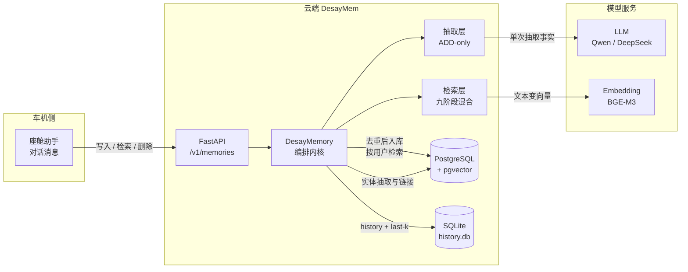
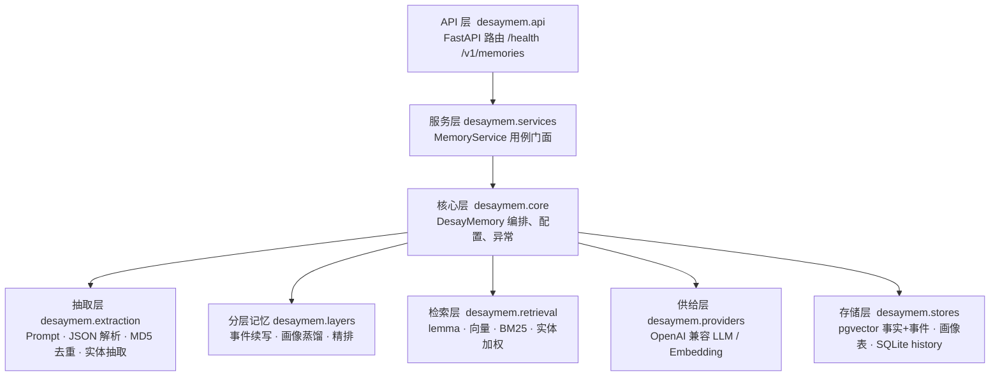
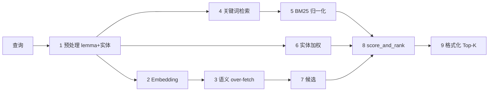
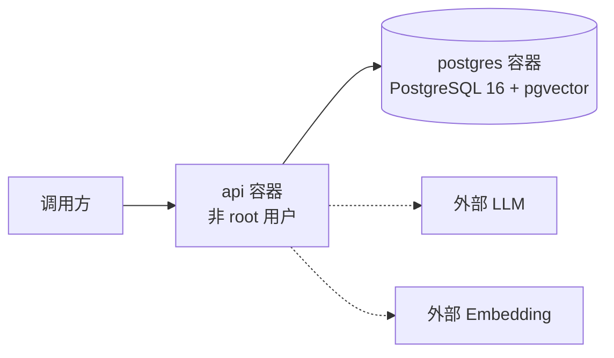

> **[归档文档]** 本文是旧架构说明，mermaid 图不含 L2/L3 层。当前架构请看 [../TECHNICAL_REPORT.md](../TECHNICAL_REPORT.md)。  
> 归档时间: 2026-09-06

# 架构说明

一句话：**座舱对话进来，经过抽取与去重，变成按租户+用户隔离的事实、事件摘要和当前画像，再用向量召回事实/事件，画像按用户直接读取。**


上图从左到右是请求方向：车机/业务 → FastAPI → DesayMemory 内核 → LLM/Embedding → PostgreSQL+pgvector。

---

## 1. 一眼看懂



| 你看到的盒子 | 实际做什么 | 不做什么 |
| --- | --- | --- |
| FastAPI | 对外 HTTP、参数校验、Swagger | 不直接调数据库写记忆 |
| DesayMemory | 把 add/search/delete 串成一条链路 | 不调用 Mem0 云 API |
| 抽取层 | 默认一次 LLM 只 ADD 新事实；`memory_type=procedural_memory` 时写流程摘要 | 不让 LLM 直接改旧 L1 行 |
| 检索层 | 九阶段召回 + 语义精排；画像按用户读取后附带 | 不做关键词意图路由、不做图检索 |
| 存储 | pgvector 事实+事件摘要 / `profile_beliefs` 画像 / SQLite history / 实体库 | 不引入 Neo4j |

---

## 2. 分层（代码怎么对应）



| 分层 | 包 | 职责 |
| --- | --- | --- |
| API | `desaymem.api` | HTTP、校验、错误映射、Swagger |
| 服务 | `desaymem.services` | 用例门面，给路由调用 |
| 核心 | `desaymem.core` | `DesayMemory`、配置、模型、异常 |
| 抽取 | `desaymem.extraction` | ADD-only Prompt、流程记忆 Prompt、JSON 解析、MD5 去重、实体抽取与链接 |
| 分层 | `desaymem.layers` | L2 事件续写判断、L3 信念蒸馏、检索精排（均无关键词路由） |
| 检索 | `desaymem.retrieval` | 九阶段：lemma、向量、BM25、实体加权、阈值 |
| 供给 | `desaymem.providers` | OpenAI 兼容 LLM / Embedding |
| 存储 | `desaymem.stores` | `memory_items`（事实+事件向量）+ `profile_beliefs` + `history.db` + `memory_entities` |

---

## 3. 写入怎么走（add）

对齐 Mem0 OSS 2.0.18 七阶段 add：**LLM 只 ADD 新事实，不改旧记忆。**

```mermaid
sequenceDiagram
    autonumber
    participant 车机 as 座舱助手
    participant API as FastAPI
    participant Core as DesayMemory
    participant LLM as LLM
    participant Emb as Embedding
    participant Vec as pgvector
    participant SQL as SQLite history.db

    车机->>API: POST /v1/memories<br/>对话 + tenant_id + user_id
    API->>Core: add(messages, user, infer/memory_type)
    Note over Core,SQL: Phase 0 上下文
    Core->>SQL: 读取该会话最近 k 条消息
    SQL-->>Core: last-k
    Note over Core,Vec: Phase 1 已有记忆
    Core->>Emb: 把本轮对话编成向量
    Emb-->>Core: 查询向量
    Core->>Vec: 同一租户+用户 top 10
    Vec-->>Core: 已有事实
    Note over Core,LLM: Phase 2 单次抽取
    Core->>LLM: ADD-only Prompt（带 last-k）
    LLM-->>Core: {"memory": ["用户开车空调22度", ...]}
    Note over Core: Phase 3–5 向量化 + lemma + MD5
    Core->>Core: 去重后给新事实做 Embedding / lemma
    Note over Core,Vec: Phase 6 持久化
    Core->>Vec: 写入 memory_items
    Core->>SQL: history ADD
    Note over Core,Vec: Phase 7 实体链接
    Core->>Emb: 给抽取到的实体做 Embedding
    Core->>Vec: 写入/更新 memory_entities
    Core->>SQL: 保存本轮消息（保留最近 10 条）
    Vec-->>API-->>车机: 新记忆列表
```

中文要点：

1. 先查「这个用户已经有什么」，避免 LLM 把旧事实再抽一遍。
2. 只调用 **一次** LLM。
3. 再用内容哈希去重；数据库还有 `(tenant_id, user_id, content_hash)` 唯一约束兜底。
4. v1 **没有** UPDATE / DELETE 事件从 LLM 发出；`history` 只记调用方的 ADD / DELETE。
5. `memory_type=procedural_memory` 走另一条路：用流程摘要 Prompt 生成一条 `procedural_memory`，不走 ADD-only 抽取。
6. `infer=false` 时不调用 LLM，把非 system 消息原文写入记忆库。
7. last-k 与 history 只写 SQLite，不双写 Postgres `session_messages`。

---

## 4. 检索怎么走（search）



- 相似度不够：还要过租户和用户，**绝不只靠向量**。
- BM25 只给语义候选加权，不会单独把关键词命中抬进结果集（与 Mem0 一致）。
- 删除单条时也校验归属：用户 A 删不了用户 B。

---

## 5. 部署拓扑（Docker Compose）



只有两个进程：`api` 和 `postgres`。SQLite `history.db` 在 API 进程内。没有 Redis、Neo4j、NATS。  
表结构由 `migrations/001_initial.sql`、`002_session_entities.sql`、`003_bm25.sql`、`004_layers.sql` 维护；**启动只检查 schema，首次请求不会偷偷改表。**

---

## 6. 隔离字段

每条记忆带上车载上下文，但 v1 强制隔离键只有两个：

| 字段 | 含义 | v1 是否强制过滤 |
| --- | --- | --- |
| `tenant_id` | 车企 / 项目 | 是 |
| `user_id` | 用户 | 是 |
| `vehicle_id` | 车辆 | 可选 |
| `occupant_id` | 乘员 | 可选 |
| `session_id` | 会话 | 可选 |
| `scene` | 驾驶场景 | 可选 |
| `source` | 数据来源 | 可选 |

---

## 7. 分层记忆（L1 / L2 / L3）

L1 原子事实与 L2 事件摘要都在 `memory_items`（不同 `memory_type`，都有向量）。L3 当前信念在 `profile_beliefs`，按用户读取。设计、模糊指令效果和迁移见 [layers.md](layers.md)。

关键词路由、座舱词表、正则冲突消解 **不是** 本层的机制。写库决策来自模型 JSON + 证据 ID 校验。

---

## 8. 明确不在本图里的东西

图记忆、Skill 蒸馏、端云同步、Mem0 托管云、记忆衰减 —— 不做，图上也不画空壳模块。
