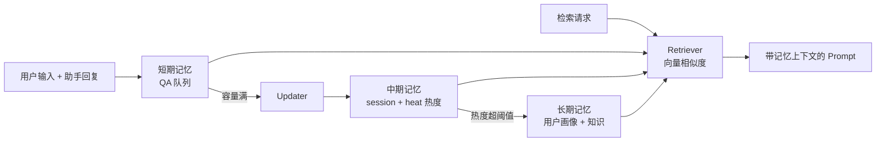

# MemoryOS Chery POC

面向奇瑞（Chery）智能座舱场景的记忆系统 POC：将开源 [MemoryOS](https://github.com/BAI-LAB/MemoryOS) 作为 **MCP Server** 集成到车端 AI Agent，为多用户提供分层记忆管理（短期对话 / 中期会话 / 长期画像）以及车端事件、车端数据的记忆扩展。

> 本项目为概念验证（Proof of Concept），基于开源 MemoryOS 二次开发，仅供内部技术评估使用。

## 项目背景

车端智能座舱助手需要"记住"用户：偏好的音乐、常去的地点、习惯的空调设置等。MemoryOS 借鉴操作系统内存管理的分层思路管理 Agent 记忆，本项目在其基础上做了车端定制：

- **MCP 协议接入**：记忆能力以 MCP (Model Context Protocol) Server 形式提供，可被 Claude Desktop、Cline、Cursor 或任意 MCP Client 调用，也支持车端 Agent 通过 HTTP (Streamable HTTP) 接入
- **车端扩展记忆模块**：新增事件记忆（`event_term`，车机 UI/状态事件）、车端数据记忆（`car_data_term`，车辆信号/状态）、用户画像标签（跨用户兴趣相似性同步）
- **会话持久化**：SQLite + FTS5 全文检索，保存/检索/压缩对话上下文，token 用量统计
- **多用户管理**：`user_list.json` + 每用户独立记忆目录，支持动态创建/删除用户
- **异步写路径**：`add_memory` / `remember_user_fact` 走内存队列 + 后台 worker 串行处理，不阻塞在线链路

## 目录结构

```
memoryos-chery_poc/
└── MemoryOS/
    ├── README.md              # 上游开源 MemoryOS 文档（论文、架构、原版用法）
    └── memoryos-mcp/          # 本项目核心：MCP Server
        ├── server_new.py      # MCP 服务器主入口（stdio / HTTP 双模式）
        ├── config.json        # 运行时配置（LLM、Embedding、容量、阈值）
        ├── mcp.json           # MCP 客户端接入配置示例
        ├── user_list.json     # 已注册用户列表
        ├── requirements.txt   # Python 依赖
        ├── memoryos/          # MemoryOS 核心库（车端定制版）
        │   ├── memoryos.py        # Memoryos 主类，协调各记忆模块
        │   ├── short_term.py      # 短期记忆（最近 QA 对）
        │   ├── event_term.py      # 事件记忆（车机 UI/状态事件）★新增
        │   ├── mid_term.py        # 中期记忆（session + heat 热度机制）
        │   ├── long_term.py       # 长期记忆（用户画像 + 知识库）
        │   ├── car_data_term.py   # 车端数据记忆 ★新增
        │   ├── user_profile_data_tag_term.py  # 用户标签/跨用户同步 ★新增
        │   ├── updater.py         # 记忆更新调度（短→中→长升级、画像/知识提取）
        │   ├── retriever.py       # 向量检索
        │   ├── utils.py           # OpenAI 客户端、嵌入、时间戳等
        │   ├── prompts.py         # LLM 提示词模板
        │   └── persistence/       # SQLite 会话持久化（FTS5）
        │       ├── session_db.py
        │       ├── session_persistence.py
        │       └── tools/         # 会话/消息/压缩 MCP 工具
        └── memoryos_data/     # 运行时数据（自动生成，不入库）
            └── users/<user_id>/   # 每用户 short/mid/long term JSON
```

★ 标记为相对上游开源版的定制新增模块。

## 记忆流转



检索时将三层记忆的相关片段注入 prompt，交由 LLM 生成个性化回复。

## 环境要求

- Python >= 3.10（POC 验证环境为 3.12）
- 一个 OpenAI 兼容的 LLM API（OpenAI / Deepseek / Qwen / vLLM 本地部署均可）
- Embedding：云 API（OpenAI 兼容 `/embeddings` 端点）或本地模型（BAAI/bge-m3、Qwen3-Embedding 等通过 sentence-transformers / FlagEmbedding 加载）
- 向量检索依赖 faiss（`requirements.txt` 中为 `faiss-gpu`，无 GPU 环境可改为 `faiss-cpu`）

## 快速开始

### 1. 安装依赖

```bash
cd memoryos-chery_poc/MemoryOS/memoryos-mcp
pip install -r requirements.txt
```

### 2. 配置 config.json

```bash
cp config.json config.local.json   # 按需修改，避免改动示例配置
```

关键字段：

| 字段 | 说明 |
|------|------|
| `openai_api_key` / `openai_base_url` | LLM API（OpenAI 兼容协议） |
| `llm_model` | 模型名，如 `Deepseek-V4-Flash`、本地 GGUF 部署填模型路径 |
| `embedding_model_name` | 云端模型名（含 `vision` 走多模态端点）或本地模型路径 |
| `embedding_model_kwargs` | 云端 embedding 的 `api_key` / `base_url` |
| `data_storage_path` | 记忆 JSON 数据目录，运行时自动生成 |
| `short_term_capacity` | 短期记忆容量（QA 对数），满则触发升级 |
| `mid_term_capacity` / `mid_term_heat_threshold` | 中期记忆容量与热度阈值 |
| `mid_term_similarity_threshold` | 会话合并相似度阈值 |
| `event_term_capacity` / `car_data_capacity` | 车端事件/数据记忆容量 |

### 3. 启动 MCP Server

```bash
# stdio 模式（Claude Desktop / Cline / Cursor 等桌面客户端）
python server_new.py --config config.json

# HTTP 模式（Streamable HTTP，供车端 Agent 远程调用）
python server_new.py --config config.json --http --host 0.0.0.0 --port 7860
```

启动时会：初始化 SessionDB（`./session_memory.db`）→ 加载 `user_list.json` 中全部用户的记忆实例 → 注册会话持久化工具 → 启动后台 worker（记忆队列 / 画像更新 / 内存定时回收）→ 运行 MCP 服务。另有一个内部 HTTP 健康服务监听 `port+1`。

### 4. 客户端接入（stdio 模式）

在 Claude Desktop / Cline / Cursor 的 MCP 配置中加入（参考 `mcp.json`）：

```json
{
  "mcpServers": {
    "memoryos": {
      "command": "python",
      "args": [
        "/path/to/memoryos-mcp/server_new.py",
        "--config",
        "/path/to/memoryos-mcp/config.json"
      ]
    }
  }
}
```

HTTP 模式下，MCP 端点为 `http://<host>:7860/mcp`。

## MCP 工具一览

### 记忆管理

| 工具 | 说明 |
|------|------|
| `add_memory` | 添加对话记忆（用户输入 + 助手回复），异步队列处理不阻塞 |
| `retrieve_memory` | 按查询从短/中/长期记忆向量检索相关内容 |
| `retrieve_memory_by_theme` | 按主题类型检索历史对话 |
| `retrieve_event_memory` | 检索车端事件记忆 |
| `add_event_memory` | 添加车端事件记忆（UI 状态、app 状态等） |
| `remember_user_fact` | 记住一条用户事实，LLM 异步融合进用户画像 |
| `get_user_profile` | 获取用户画像（人格、偏好、知识库） |
| `retrieve_user_profile_by_action` | 根据行为反查用户画像（如"该用户听歌时会做什么"） |
| `get_response` | 生成带记忆上下文的个性化回复 |

### 用户管理

| 工具 | 说明 |
|------|------|
| `create_memoryos_user` | 创建用户（初始化记忆目录） |
| `delete_memoryos_user` | 删除用户及记忆数据 |
| `check_memoryos_user_exists` | 检查用户是否存在 |

### 会话持久化（SQLite + FTS5）

| 工具 | 说明 |
|------|------|
| `save_conversation` / `save_messages` | 保存单轮/批量对话消息 |
| `session_create` / `session_end` / `session_get` / `session_list` / `session_delete` / `session_set_title` | 会话生命周期管理 |
| `message_append` / `message_list` / `message_search` / `message_delete` | 消息增删查（FTS5 全文搜索） |
| `session_compress` / `session_get_chain` / `session_get_tip` | 会话压缩链与最新节点 |

### MCP Resources

- `memoryos://status` — 系统运行状态
- `memoryos://config` — 当前配置信息

## 测试脚本

`memoryos-mcp/` 下的 `test_*.py` 为 POC 验证脚本，按需启动 HTTP 服务后运行：

```bash
python server_new.py --config config.json --http --port 7860   # 终端 1
python test_simple.py                                          # 终端 2，按脚本内 BASE_URL 调整
```

覆盖场景：用户创建/删除顺序、双用户记忆隔离、跨用户画像同步、按行为检索画像、批量消息导入等。

## 与上游 MemoryOS 的关系

- 上游项目：[BAI-LAB/MemoryOS](https://github.com/BAI-LAB/MemoryOS)（论文 [arXiv:2506.06326](https://arxiv.org/abs/2506.06326)）
- `memoryos/` 核心库（short/mid/long term、updater、retriever）源自上游，`MemoryOS/README.md` 保留了上游完整文档
- 本仓库新增：MCP Server 封装（`server_new.py`）、车端事件/数据记忆、用户标签跨用户同步、SQLite 会话持久化层

## License

上游 MemoryOS 采用 Apache 2.0 License。本项目仅用于内部 POC 评估。
